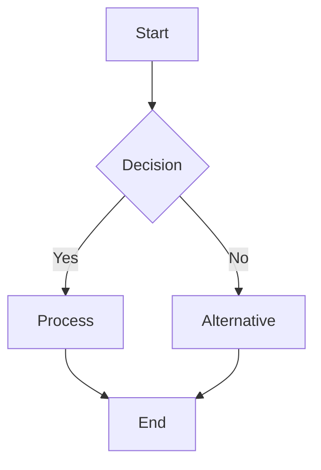
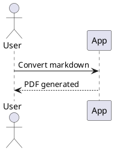

# Markdown to PDF: Feature Showcase

This example demonstrates the script's key features: Mermaid and PlantUML diagrams, page breaks, and embedded images. Convert it by running: `python convert_md_to_pdf.py --source ./docs`.

## 1) Mermaid diagram



## 1b) Mermaid diagram without resizing

This diagram uses the `<!-- no-resize -->` comment to keep its original rendered size:

<!-- no-resize -->


## 2) PlantUML sequence



## 3) Embedded image

The converter will copy local images into the temp directory so they render reliably in the PDF.


## 4) Indentation and block examples

Demonstration of nested indentation in text and code.

### Text nesting

- Level 1
  - Level 2
    - Level 3

> Level 1
> > Level 2
> > > Level 3

### Code block (Python)

```python
def process(items):
    for group in items:
        for item in group:
            if item["active"]:
                print(f"- {item['name']}")
```

## 5) Page break options

You can force a new page using any of the supported markers:

| Method | Syntax | Description |
|--------|--------|-------------|
| HTML Comment | `<!-- page-break -->` | Clean, comment-based page break |
| HTML Div | `<div class="page-break"></div>` | HTML div element with page-break class |
| Custom Tag | `<page-break>` | Simple custom tag for page breaks |
| Markdown Div | ````page-break```` | Markdown div syntax |
| Horizontal Rule | `---` | Standard markdown horizontal rule |
| CSS Class | `{.page-break}` | CSS class applied to horizontal rule |

Each method is normalized to a printable page break in the final PDF.


