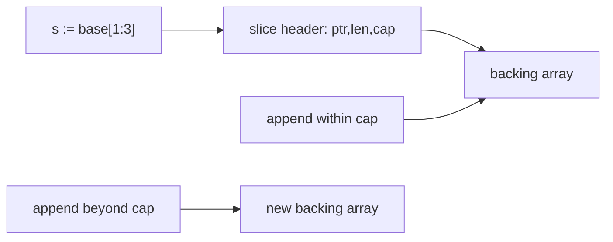
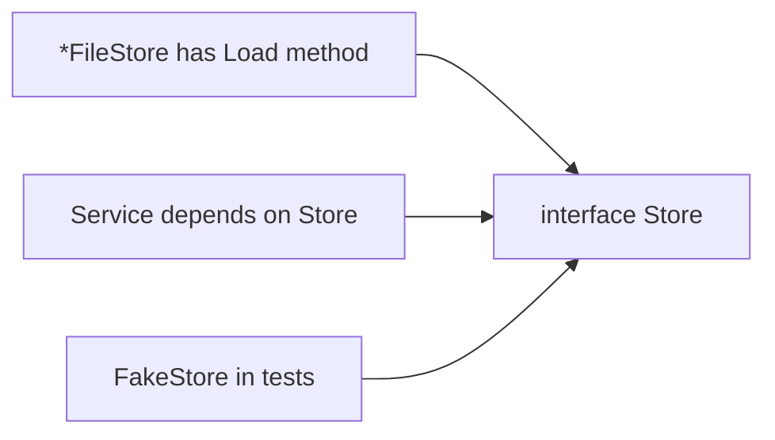
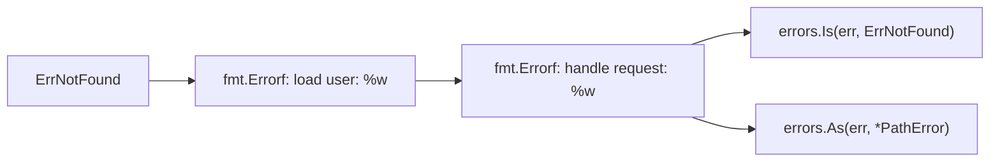
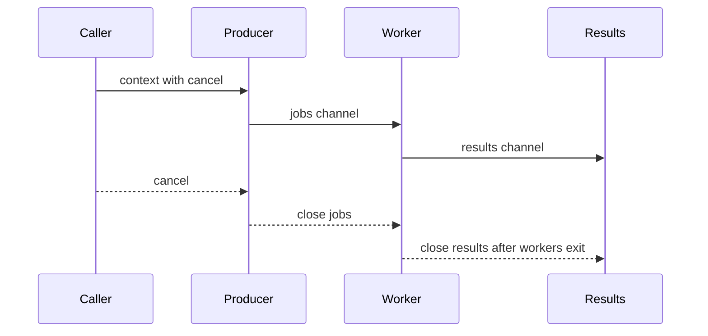
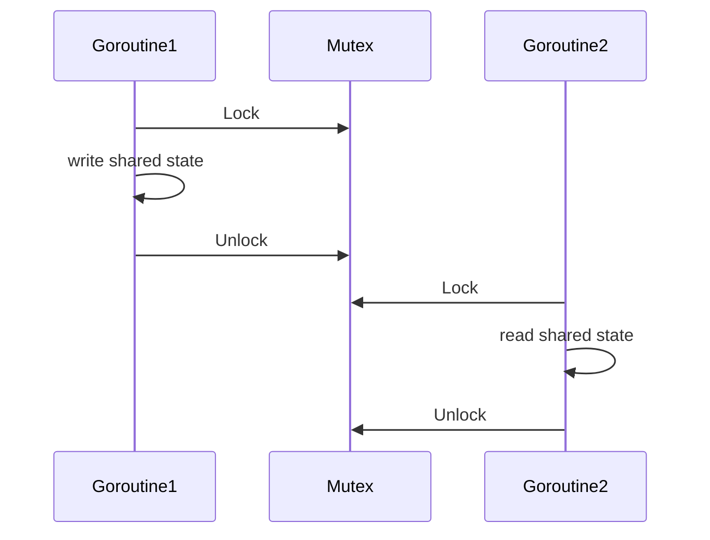
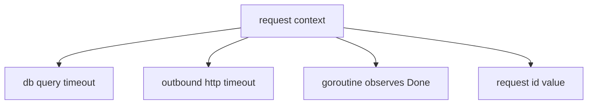
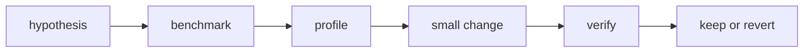
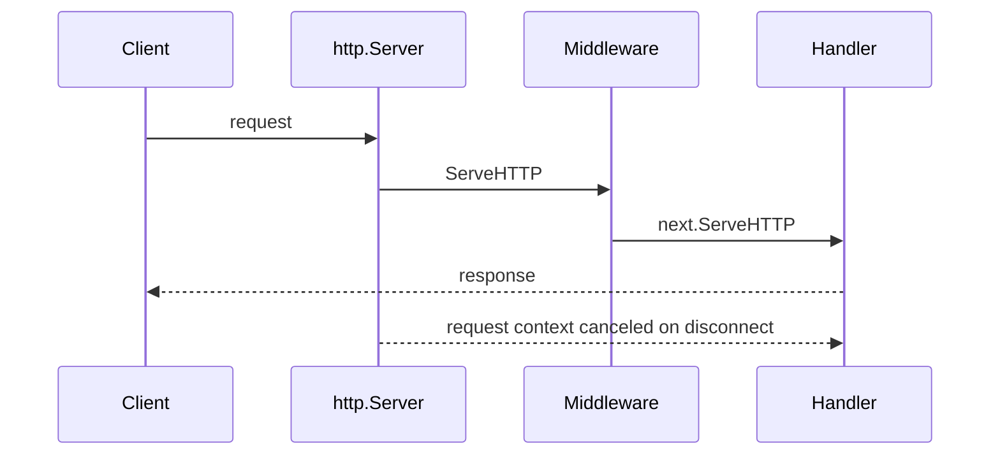

# Go Advanced Fundamentals and Standard Library Refresher

<!-- markdownlint-disable MD010 MD024 -->

Audience: experienced software engineers refreshing Go at a staff level. This guide stays inside Go and the standard library: language mechanics, runtime behavior, concurrency, backend service primitives, testing, profiling, and review heuristics.

Use it as a cheat sheet, not a tutorial. Each section favors syntax, edge cases, and production judgment.

---

## 1. Staff-Level Mental Model

### Recall

Go optimizes for simple composition, explicit control flow, fast builds, readable APIs, cheap concurrency, and operational predictability.

### Syntax

```go
package orders

import (
	"context"
	"errors"
	"time"
)

type Store interface {
	Load(ctx context.Context, id string) (Order, error)
}

type Service struct {
	store Store
	now   func() time.Time
}

func NewService(store Store, now func() time.Time) *Service {
	if now == nil {
		now = time.Now
	}
	return &Service{store: store, now: now}
}
```

### Staff Notes

- Prefer boring APIs with clear ownership over clever abstractions.
- Keep interfaces small and usually define them at the consumer, not the producer.
- Make zero values useful when practical: `bytes.Buffer`, `sync.Mutex`, `http.Server` are good examples.
- Treat cancellation, timeouts, and error wrapping as API contract details.
- Optimize only after measuring with benchmarks or profiles.

### Sharp Edges

- Go has no inheritance, exceptions, constructors, implicit numeric conversions, or generic methods.
- Exported names are package API. Compatibility matters once callers exist.
- Goroutines are cheap, not free. Every goroutine needs a shutdown story.

---

## 2. Syntax and Declarations

### Recall

Use declarations to communicate lifetime and scope. Use short assignment when the variable is local and immediately initialized.

### Syntax

```go
const (
	StatusPending = iota
	StatusPaid
	StatusFailed
)

var defaultTimeout = 5 * time.Second

func classify(n int) string {
	switch {
	case n < 0:
		return "negative"
	case n == 0:
		return "zero"
	default:
		return "positive"
	}
}

func parse(raw string) (id string, ok bool) {
	if raw == "" {
		return "", false
	}
	return raw, true
}
```

### Defer

`defer` runs after the surrounding function returns. Arguments are evaluated immediately.

```go
func copyFile(dst, src string) (err error) {
	in, err := os.Open(src)
	if err != nil {
		return err
	}
	defer in.Close()

	out, err := os.Create(dst)
	if err != nil {
		return err
	}
	defer func() {
		if closeErr := out.Close(); err == nil {
			err = closeErr
		}
	}()

	_, err = io.Copy(out, in)
	return err
}
```

### Staff Notes

- Named returns can help when a deferred closure must modify the returned error. Do not use them everywhere.
- `init` is for unavoidable package setup. Prefer explicit construction.
- Shadowing with `:=` is legal and can hide bugs in long functions.

### Sharp Edges

```go
var err error
if value, err := load(); err != nil {
	return err
} else {
	_ = value
}
// Outer err is still nil here.
_ = err
```

---

## 3. Values, Pointers, Methods, and Embedding

### Recall

Assignment copies values. Slices, maps, channels, functions, and interfaces are small descriptors pointing at shared runtime data. Struct copies can be expensive or semantically wrong if they contain locks or shared state.

### Syntax

```go
type Money struct {
	Cents    int64
	Currency string
}

func (m Money) Add(other Money) (Money, error) {
	if m.Currency != other.Currency {
		return Money{}, errors.New("currency mismatch")
	}
	return Money{Cents: m.Cents + other.Cents, Currency: m.Currency}, nil
}

type Counter struct {
	n int64
}

func (c *Counter) Inc() {
	c.n++
}
```

### Method Sets

```go
type Flusher interface {
	Flush() error
}

type Buffer struct{}

func (b *Buffer) Flush() error { return nil }

var _ Flusher = (*Buffer)(nil)
// var _ Flusher = Buffer{} // does not compile: Flush has pointer receiver
```

### Embedding

Embedding promotes fields and methods. It is composition syntax, not inheritance.

```go
type Logger struct{}

func (Logger) Info(msg string) {}

type Worker struct {
	Logger
	name string
}

func run() {
	var w Worker
	w.Info("started")
}
```

### Staff Notes

- Use value receivers for immutable small values. Use pointer receivers for mutation, large structs, or consistency when any method needs a pointer.
- Do not copy values containing `sync.Mutex`, `sync.WaitGroup`, `sync.Once`, or `atomic` fields after first use.
- Prefer explicit fields over embedding when promoted methods would make the API surprising.

---

## 4. Slices, Maps, and Strings

### Recall

A slice is a descriptor: pointer, length, capacity. Appending can reuse the same backing array or allocate a new one.



### Syntax

```go
xs := []int{1, 2, 3, 4}
head := xs[:2]
tail := xs[2:]

ys := make([]int, 0, len(xs))
ys = append(ys, xs...)

counts := map[string]int{"go": 1}
counts["go"]++
delete(counts, "missing")
value, ok := counts["go"]
_, _ = value, ok
```

### Slice Aliasing

```go
func unsafePrefix(xs []int) []int {
	return xs[:1] // caller and callee still share backing array
}

func safePrefix(xs []int) []int {
	return append([]int(nil), xs[:1]...)
}
```

### Strings and Bytes

```go
s := "cafe"
b := []byte(s)
_ = b

for i, r := range "cafe" {
	fmt.Printf("byte=%d rune=%q\n", i, r)
}

joined := strings.Join([]string{"a", "b", "c"}, ",")
n, err := strconv.Atoi("42")
_, _ = joined, n
if err != nil {
	return err
}
```

### Staff Notes

- Preallocate slices when size is known or bounded.
- Map iteration order is deliberately randomized. Sort keys for deterministic output.
- A substring or subslice can retain a large backing allocation. Copy if you need a small long-lived value.
- Strings are immutable byte sequences; `range` decodes UTF-8 into runes.

### Sharp Edges

```go
var m map[string]int
// m["x"] = 1 // panic: assignment to entry in nil map

var s []int
s = append(s, 1) // ok: append works on nil slice
```

---

## 5. Interfaces and Generics

### Recall

Interfaces are satisfied implicitly. Use them to describe behavior required by the consumer. Generics remove duplication when algorithms truly vary by type, but they are not a replacement for interfaces.



### Interfaces

```go
type Reader interface {
	Read(p []byte) (n int, err error)
}

func CountBytes(r io.Reader) (int64, error) {
	return io.Copy(io.Discard, r)
}
```

### Generics

```go
type Set[T comparable] map[T]struct{}

func NewSet[T comparable](items ...T) Set[T] {
	s := make(Set[T], len(items))
	for _, item := range items {
		s[item] = struct{}{}
	}
	return s
}

func (s Set[T]) Has(item T) bool {
	_, ok := s[item]
	return ok
}
```

### Constraints and Type Sets

```go
type Integer interface {
	~int | ~int8 | ~int16 | ~int32 | ~int64 |
		~uint | ~uint8 | ~uint16 | ~uint32 | ~uint64 | ~uintptr
}

func Max[T Integer](a, b T) T {
	if a > b {
		return a
	}
	return b
}
```

### Staff Notes

- A good interface is usually one to three methods.
- Return concrete types from constructors. Accept interfaces at boundaries.
- `interface{}` and `any` are identical. Prefer `any` in modern code.
- Use compile-time assertions for important interface contracts.

```go
var _ io.Reader = (*bytes.Buffer)(nil)
```

### Sharp Edges

- A nil concrete pointer stored in an interface is not a nil interface.

```go
var buf *bytes.Buffer
var r io.Reader = buf
fmt.Println(r == nil) // false
```

---

## 6. Error Handling and API Contracts

### Recall

Errors are values. Design them so callers can make decisions without parsing strings.



### Syntax

```go
var ErrNotFound = errors.New("not found")

type ValidationError struct {
	Field string
	Msg   string
}

func (e *ValidationError) Error() string {
	return e.Field + ": " + e.Msg
}

func load(id string) error {
	if id == "" {
		return &ValidationError{Field: "id", Msg: "required"}
	}
	return fmt.Errorf("load %q: %w", id, ErrNotFound)
}

func handle() error {
	err := load("42")
	if errors.Is(err, ErrNotFound) {
		return nil
	}

	var validation *ValidationError
	if errors.As(err, &validation) {
		return fmt.Errorf("bad request: %w", validation)
	}
	return err
}
```

### Joining Errors

```go
func closeAll(closers ...io.Closer) error {
	var errs []error
	for _, c := range closers {
		if err := c.Close(); err != nil {
			errs = append(errs, err)
		}
	}
	return errors.Join(errs...)
}
```

### Panic Boundary

```go
func recoverToError(fn func()) (err error) {
	defer func() {
		if r := recover(); r != nil {
			err = fmt.Errorf("panic: %v", r)
		}
	}()
	fn()
	return nil
}
```

### Staff Notes

- Wrap with `%w` when callers may need the cause.
- Do not expose sentinel errors casually; they become API.
- Reserve panic for programmer errors, impossible states, or process-level boundaries.
- Always define whether `context.Canceled` and `context.DeadlineExceeded` are returned, wrapped, or translated.

---

## 7. Concurrency

### Recall

Concurrency is structure. A goroutine should have a bounded lifetime, a cancellation path, and a clear owner for closing channels.

### Goroutines, Channels, Select

```go
func First(ctx context.Context, urls []string, fetch func(context.Context, string) (string, error)) (string, error) {
	ctx, cancel := context.WithCancel(ctx)
	defer cancel()

	type result struct {
		body string
		err  error
	}

	ch := make(chan result, len(urls))
	for _, url := range urls {
		url := url
		go func() {
			body, err := fetch(ctx, url)
			ch <- result{body: body, err: err}
		}()
	}

	var lastErr error
	for range urls {
		select {
		case <-ctx.Done():
			return "", ctx.Err()
		case res := <-ch:
			if res.err == nil {
				cancel()
				return res.body, nil
			}
			lastErr = res.err
		}
	}
	return "", lastErr
}
```

### Pipeline Shutdown



### Worker Pool

```go
func MapLimit[T any, R any](
	ctx context.Context,
	items []T,
	limit int,
	fn func(context.Context, T) (R, error),
) ([]R, error) {
	if limit <= 0 {
		return nil, errors.New("limit must be positive")
	}

	ctx, cancel := context.WithCancel(ctx)
	defer cancel()

	results := make([]R, len(items))
	errCh := make(chan error, 1)
	sem := make(chan struct{}, limit)
	var wg sync.WaitGroup

	for i, item := range items {
		select {
		case <-ctx.Done():
			select {
			case err := <-errCh:
				return nil, err
			default:
				return nil, ctx.Err()
			}
		case sem <- struct{}{}:
		}

		wg.Add(1)
		go func(i int, item T) {
			defer wg.Done()
			defer func() { <-sem }()

			result, err := fn(ctx, item)
			if err != nil {
				select {
				case errCh <- err:
				default:
				}
				cancel()
				return
			}
			results[i] = result
		}(i, item)
	}

	done := make(chan struct{})
	go func() {
		wg.Wait()
		close(done)
	}()

	select {
	case <-ctx.Done():
		return nil, ctx.Err()
	case err := <-errCh:
		return nil, err
	case <-done:
		return results, nil
	}
}
```

### Staff Notes

- The sender usually closes the channel.
- Never close a channel from the receiver unless ownership is explicit.
- Use buffered channels for bounded queues or semaphores, not as a substitute for backpressure design.
- Prefer `context.Context` for cancellation across API boundaries.

### Sharp Edges

```go
for _, item := range items {
	item := item // keep this pattern when supporting older Go versions
	go func() {
		_ = item
	}()
}
```

---

## 8. Synchronization and the Memory Model

### Recall

Use synchronization to establish ordering, not only mutual exclusion. If two goroutines access the same variable and at least one write is unsynchronized, that is a data race.



### Mutex

```go
type Cache struct {
	mu sync.RWMutex
	m  map[string]string
}

func NewCache() *Cache {
	return &Cache{m: make(map[string]string)}
}

func (c *Cache) Get(key string) (string, bool) {
	c.mu.RLock()
	defer c.mu.RUnlock()
	v, ok := c.m[key]
	return v, ok
}

func (c *Cache) Set(key, value string) {
	c.mu.Lock()
	defer c.mu.Unlock()
	c.m[key] = value
}
```

### Once

```go
type Lazy struct {
	once sync.Once
	v    string
	err  error
}

func (l *Lazy) Value() (string, error) {
	l.once.Do(func() {
		l.v, l.err = expensive()
	})
	return l.v, l.err
}
```

### Atomic

```go
type Gauge struct {
	n atomic.Int64
}

func (g *Gauge) Add(delta int64) { g.n.Add(delta) }
func (g *Gauge) Load() int64     { return g.n.Load() }
```

### Staff Notes

- `Mutex.Unlock` happens-before a later `Mutex.Lock` on the same mutex.
- Channel send happens-before the corresponding receive.
- Closing a channel happens-before a receive that observes the close.
- Atomics are best for narrow state, counters, and publication patterns. They are easy to misuse for compound invariants.
- `sync.Pool` is a cache for temporary objects. The runtime may drop entries at any time.

### Sharp Edges

- `RWMutex` can be slower than `Mutex` when writes are common or critical sections are tiny.
- `WaitGroup.Add` should happen before launching the goroutine, not inside it.
- Do not copy synchronized values after first use.

---

## 9. Context

### Recall

`context.Context` carries cancellation, deadlines, and request-scoped values across API boundaries. It is not a dependency injection container.



### Syntax

```go
func handler(w http.ResponseWriter, r *http.Request) {
	ctx, cancel := context.WithTimeout(r.Context(), 200*time.Millisecond)
	defer cancel()

	result, err := load(ctx, r.PathValue("id"))
	if err != nil {
		http.Error(w, err.Error(), http.StatusGatewayTimeout)
		return
	}
	_ = json.NewEncoder(w).Encode(result)
}

func load(ctx context.Context, id string) (string, error) {
	select {
	case <-ctx.Done():
		return "", ctx.Err()
	case <-time.After(10 * time.Millisecond):
		return id, nil
	}
}
```

### Staff Notes

- `context.Context` is the first parameter by convention.
- Do not store contexts in structs except for rare lifecycle objects.
- Always call cancel functions to release timers and resources.
- Use values only for request metadata that crosses boundaries, such as request IDs or auth claims.

---

## 10. Runtime and Performance

### Recall

Go uses growing goroutine stacks, garbage collection, escape analysis, and a scheduler multiplexing goroutines over OS threads. Performance work should be measured.

### Allocation and Escape Analysis

```go
func stackLikely() int {
	x := 42
	return x
}

func heapLikely() *int {
	x := 42
	return &x
}
```

Run:

```bash
go test -run '^$' -bench . -benchmem
go test -gcflags='-m=2' ./...
```

### Benchmarking Loop



### Staff Notes

- Measure allocations with `-benchmem`.
- Avoid premature pooling. `sync.Pool` can increase complexity and hurt locality.
- Prefer clear data ownership to defensive copying everywhere.
- Keep hot structs compact; field order can affect padding.
- Avoid repeated string concatenation in loops. Use `strings.Builder`.

### Micro-Example

```go
func JoinQuoted(items []string) string {
	var b strings.Builder
	for i, item := range items {
		if i > 0 {
			b.WriteString(", ")
		}
		b.WriteByte('"')
		b.WriteString(item)
		b.WriteByte('"')
	}
	return b.String()
}
```

---

## 11. Backend Standard Library

### Recall

The standard library gives you production-grade HTTP primitives, but you must configure timeouts, cancellation, body limits, and shutdown behavior.



### HTTP Server

```go
func newServer(handler http.Handler) *http.Server {
	return &http.Server{
		Addr:              ":8080",
		Handler:           handler,
		ReadHeaderTimeout: 2 * time.Second,
		ReadTimeout:       5 * time.Second,
		WriteTimeout:      10 * time.Second,
		IdleTimeout:       60 * time.Second,
	}
}

func logging(next http.Handler) http.Handler {
	return http.HandlerFunc(func(w http.ResponseWriter, r *http.Request) {
		start := time.Now()
		next.ServeHTTP(w, r)
		slog.Info("request", "method", r.Method, "path", r.URL.Path, "dur", time.Since(start))
	})
}
```

### HTTP Client

```go
var client = &http.Client{
	Timeout: 2 * time.Second,
	Transport: &http.Transport{
		MaxIdleConns:        100,
		MaxIdleConnsPerHost: 10,
		IdleConnTimeout:     90 * time.Second,
	},
}

func fetch(ctx context.Context, url string) ([]byte, error) {
	req, err := http.NewRequestWithContext(ctx, http.MethodGet, url, nil)
	if err != nil {
		return nil, err
	}

	resp, err := client.Do(req)
	if err != nil {
		return nil, err
	}
	defer resp.Body.Close()

	if resp.StatusCode < 200 || resp.StatusCode >= 300 {
		return nil, fmt.Errorf("unexpected status: %s", resp.Status)
	}
	return io.ReadAll(io.LimitReader(resp.Body, 1<<20))
}
```

### JSON

```go
type CreateUserRequest struct {
	Email string `json:"email"`
	Name  string `json:"name,omitempty"`
}

func decodeJSON[T any](r io.Reader, max int64) (T, error) {
	var v T
	dec := json.NewDecoder(io.LimitReader(r, max))
	dec.DisallowUnknownFields()
	if err := dec.Decode(&v); err != nil {
		return v, err
	}
	return v, nil
}
```

### `database/sql` Shape

```go
func transfer(ctx context.Context, db *sql.DB, from, to string, cents int64) error {
	tx, err := db.BeginTx(ctx, &sql.TxOptions{Isolation: sql.LevelSerializable})
	if err != nil {
		return err
	}
	defer tx.Rollback()

	if _, err := tx.ExecContext(ctx, "UPDATE accounts SET cents = cents - ? WHERE id = ?", cents, from); err != nil {
		return err
	}
	if _, err := tx.ExecContext(ctx, "UPDATE accounts SET cents = cents + ? WHERE id = ?", cents, to); err != nil {
		return err
	}
	return tx.Commit()
}
```

### Staff Notes

- Always close response bodies.
- Use request contexts for outbound calls.
- Server timeouts are not optional on public servers.
- Limit request and response bodies when input size is untrusted.
- `database/sql` requires a driver, but its interfaces, context methods, transactions, and pooling model are standard library concepts.

---

## 12. I/O and Filesystem

### Recall

`io.Reader` and `io.Writer` are core composition points. Design streaming APIs around them when data may be large.

### Syntax

```go
func hash(r io.Reader) ([32]byte, error) {
	h := sha256.New()
	if _, err := io.Copy(h, r); err != nil {
		return [32]byte{}, err
	}
	var sum [32]byte
	copy(sum[:], h.Sum(nil))
	return sum, nil
}

func readLines(r io.Reader) ([]string, error) {
	scanner := bufio.NewScanner(r)
	var lines []string
	for scanner.Scan() {
		lines = append(lines, scanner.Text())
	}
	return lines, scanner.Err()
}
```

### Filesystems

```go
func ReadConfig(fsys fs.FS, name string) ([]byte, error) {
	clean := path.Clean(name)
	if clean == "." || strings.HasPrefix(clean, "../") {
		return nil, errors.New("invalid path")
	}
	return fs.ReadFile(fsys, clean)
}
```

### Staff Notes

- `bufio.Scanner` has token size limits. Use `Reader` for very large tokens.
- Use `path` for slash-separated paths and `path/filepath` for OS filesystem paths.
- Prefer `os.CreateTemp` and `os.MkdirTemp` for temporary files.
- Streaming avoids loading entire payloads and composes better with cancellation.

---

## 13. Testing, Fuzzing, and Benchmarking

### Recall

Tests should encode behavior and edge cases. Benchmarks should answer a specific performance question.

### Table Tests

```go
func TestNormalizeEmail(t *testing.T) {
	t.Parallel()

	tests := []struct {
		name string
		in   string
		want string
	}{
		{name: "lowercase", in: "A@EXAMPLE.COM", want: "a@example.com"},
		{name: "trim", in: " a@example.com ", want: "a@example.com"},
	}

	for _, tt := range tests {
		tt := tt
		t.Run(tt.name, func(t *testing.T) {
			t.Parallel()
			got := NormalizeEmail(tt.in)
			if got != tt.want {
				t.Fatalf("NormalizeEmail(%q) = %q, want %q", tt.in, got, tt.want)
			}
		})
	}
}
```

### Fuzzing

```go
func FuzzRoundTrip(f *testing.F) {
	f.Add("hello")
	f.Fuzz(func(t *testing.T, s string) {
		encoded := url.QueryEscape(s)
		decoded, err := url.QueryUnescape(encoded)
		if err != nil {
			t.Fatal(err)
		}
		if decoded != s {
			t.Fatalf("got %q, want %q", decoded, s)
		}
	})
}
```

### Benchmark

```go
func BenchmarkJoinQuoted(b *testing.B) {
	items := []string{"alpha", "beta", "gamma"}
	b.ReportAllocs()
	for i := 0; i < b.N; i++ {
		_ = JoinQuoted(items)
	}
}
```

### Staff Notes

- Use `go test -race ./...` for data race detection.
- Use `t.Helper()` in assertion helpers.
- Use fakes over mocks when behavior is small and deterministic.
- Golden files are useful for stable text formats; provide an update path.
- Avoid asserting map iteration order.

---

## 14. Observability and Debugging With the Standard Library

### Recall

The standard library includes enough to inspect many production issues: structured logging, counters, runtime metrics, profiles, traces, and goroutine dumps.

### Logging With `log/slog`

```go
func main() {
	logger := slog.New(slog.NewJSONHandler(os.Stdout, &slog.HandlerOptions{
		Level: slog.LevelInfo,
	}))
	slog.SetDefault(logger)

	slog.Info("service started", "addr", ":8080")
}
```

### Expose Debug Endpoints

```go
import "net/http/pprof"

func serveDebug() {
	mux := http.NewServeMux()
	mux.Handle("/debug/vars", expvar.Handler())
	mux.HandleFunc("/debug/pprof/", pprof.Index)
	mux.HandleFunc("/debug/pprof/cmdline", pprof.Cmdline)
	mux.HandleFunc("/debug/pprof/profile", pprof.Profile)
	mux.HandleFunc("/debug/pprof/symbol", pprof.Symbol)
	mux.HandleFunc("/debug/pprof/trace", pprof.Trace)

	go func() {
		_ = http.ListenAndServe("127.0.0.1:6060", mux)
	}()
}
```

### Runtime Metrics

```go
func sampleHeapObjects() uint64 {
	samples := []metrics.Sample{{Name: "/gc/heap/objects:objects"}}
	metrics.Read(samples)
	return samples[0].Value.Uint64()
}
```

### Staff Notes

- Profile CPU, heap, goroutines, mutex contention, and blocking based on the symptom.
- A goroutine dump often reveals leaks faster than a heap profile.
- Treat debug endpoints as sensitive. Bind them carefully and protect access.
- Use `runtime/trace` when scheduler behavior, blocking, or latency spikes are unclear.

---

## 15. Staff Design Heuristics

### Package Boundaries

```go
// Good package names describe capability, not layer names.
package billing

// Avoid packages named util, common, base, or helpers unless the scope is truly narrow.
```

### API Design Checklist

- Is the zero value useful or intentionally invalid?
- Are exported names minimal and documented?
- Does the API accept `context.Context` where blocking or I/O can occur?
- Can callers distinguish retryable, validation, not-found, and cancellation errors?
- Are goroutines owned and stopped?
- Are timeouts explicit at network boundaries?
- Are interfaces defined at the consumer side?
- Is the test surface validating behavior rather than implementation detail?

### Dependency Injection Without Frameworks

```go
type Clock interface {
	Now() time.Time
}

type realClock struct{}

func (realClock) Now() time.Time { return time.Now() }

type TokenIssuer struct {
	clock Clock
}

func NewTokenIssuer(clock Clock) *TokenIssuer {
	if clock == nil {
		clock = realClock{}
	}
	return &TokenIssuer{clock: clock}
}
```

### Compatibility

- Adding exported names is usually compatible.
- Removing, renaming, or changing exported behavior is breaking.
- Changing struct fields can break composite literals in external packages.
- Returning a new wrapped error can affect callers using `errors.Is` or `errors.As`.

---

## 16. Interview-Style Drills

### Generic Set

Constraints:

- Use `comparable`.
- Keep zero value usable if possible.
- Define mutation and query methods clearly.

```go
type Set[T comparable] map[T]struct{}

func (s Set[T]) Add(v T) {
	s[v] = struct{}{}
}

func (s Set[T]) Has(v T) bool {
	_, ok := s[v]
	return ok
}
```

Sharp edge: the zero value of this map type is nil, so `Add` panics unless constructed. If zero-value usability matters, wrap the map in a struct and initialize lazily.

### LRU Cache With `container/list`

Constraints:

- O(1) get and put.
- Map key to list element.
- List front is most recently used.
- Protect with a mutex if concurrent.

```go
type entry[K comparable, V any] struct {
	key   K
	value V
}

type LRU[K comparable, V any] struct {
	cap int
	ll  *list.List
	m   map[K]*list.Element
}

func NewLRU[K comparable, V any](cap int) *LRU[K, V] {
	return &LRU[K, V]{
		cap: cap,
		ll:  list.New(),
		m:   make(map[K]*list.Element),
	}
}
```

### Bounded Worker Pool

Design checks:

- Who closes `jobs`?
- Who closes `results`?
- What happens on first error?
- Can workers exit on context cancellation?
- Is the queue bounded?

### Context-Aware HTTP Client

Design checks:

- Request built with `http.NewRequestWithContext`.
- Client has timeout or transport-level timeouts.
- Response body is always closed.
- Response body is bounded if untrusted.
- Status codes are translated into useful errors.

### Leak-Free Channel Pipeline

Design checks:

- Every sender can observe cancellation.
- Receivers drain or cancellation unblocks senders.
- Exactly one owner closes each channel.
- Tests cover early cancellation and downstream failure.

---

## 17. Command Cheats

```bash
go test ./...
go test -race ./...
go test -run TestName ./pkg
go test -run '^$' -bench . -benchmem ./...
go test -fuzz FuzzName ./pkg
go test -cover ./...
go test -cpuprofile cpu.out -memprofile mem.out -bench . ./pkg
go tool pprof cpu.out
go test -trace trace.out ./pkg
go tool trace trace.out
go vet ./...
go test -gcflags='-m=2' ./...
```

---

## 18. Final Review Checklist

- API: small exported surface, clear names, documented exported behavior.
- Errors: no string parsing required, wrapping is intentional, cancellation is preserved.
- Concurrency: no goroutine leaks, no send on closed channel, no unsynchronized shared state.
- Context: accepted by blocking operations, canceled by owner, not stored casually.
- HTTP: timeouts set, bodies closed, payloads bounded, shutdown path exists.
- Data: map order not assumed, slices not accidentally retaining large arrays, strings handle UTF-8 correctly.
- Performance: benchmarked before optimizing, allocation changes verified, profiles interpreted against the symptom.
- Tests: table tests include edge cases, race detector considered, fuzzing used for parsers or encoders.
