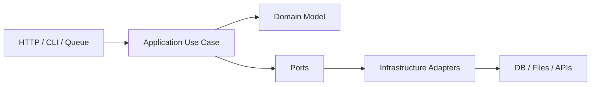
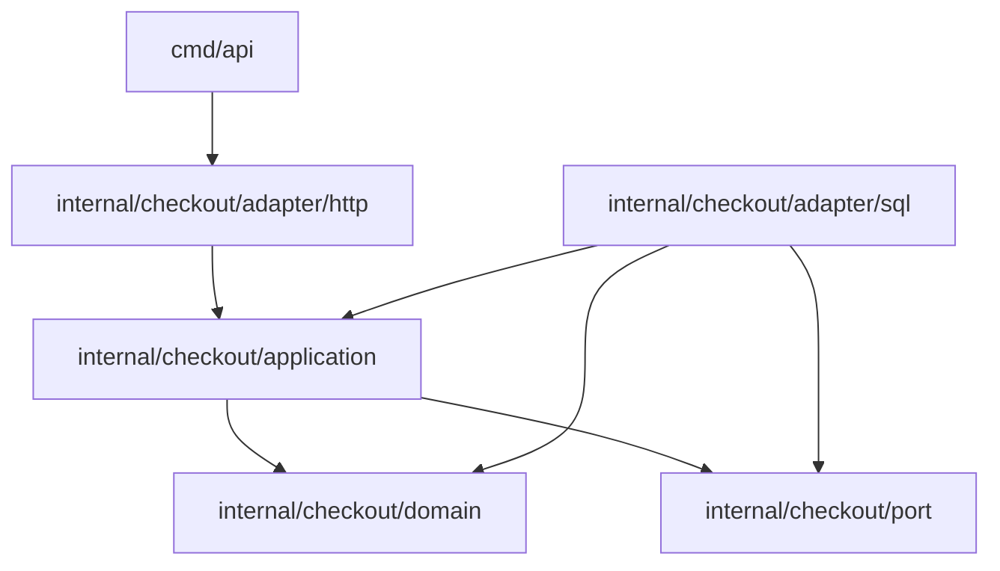
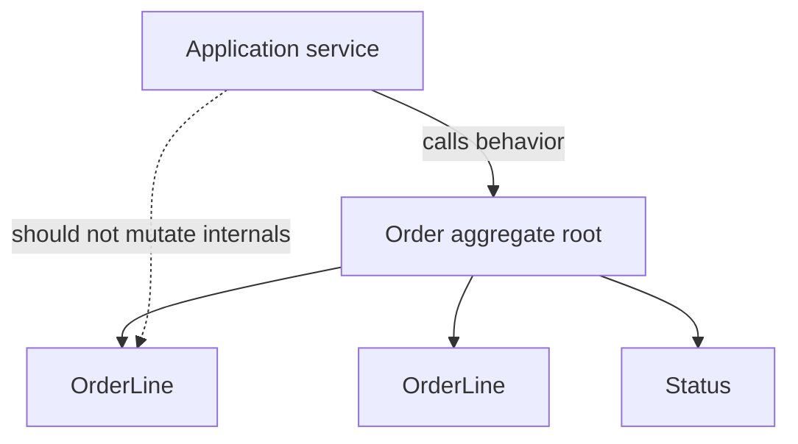
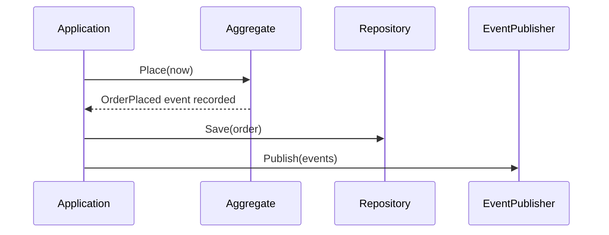
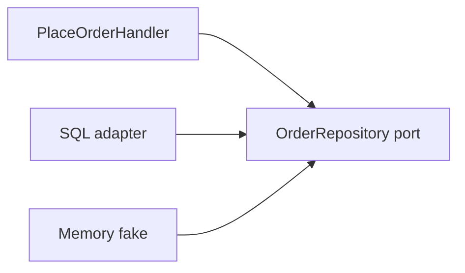
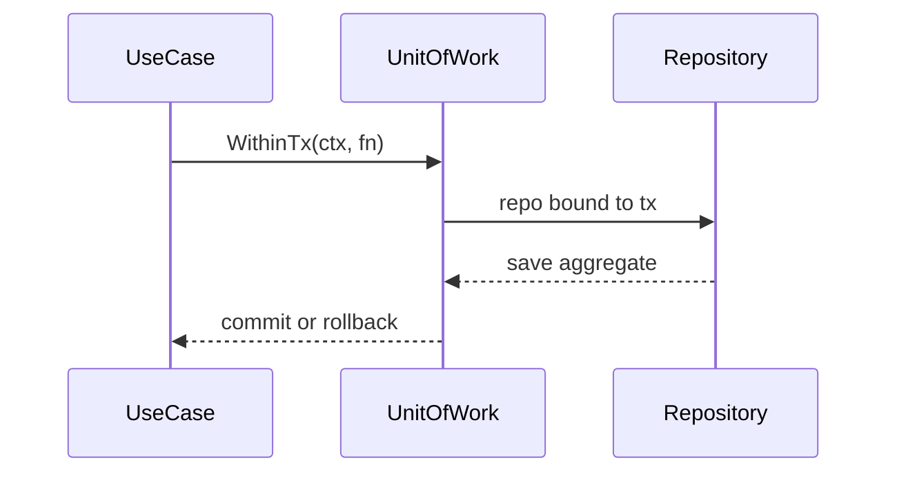
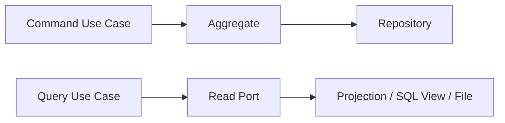
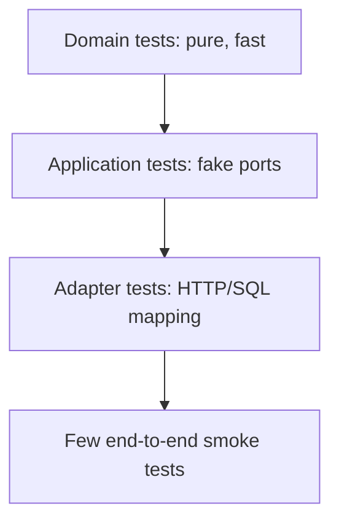
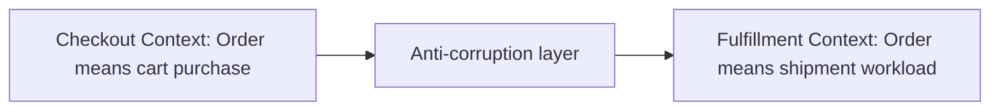
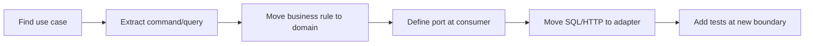

# Go DDD and Hexagonal Architecture Refresher

<!-- markdownlint-disable MD010 MD024 -->

Audience: senior and staff Go engineers who want a practical refresher on Domain-Driven Design and hexagonal architecture in Go. This guide avoids framework assumptions and uses plain Go plus the standard library in examples.

Use it as a design cheat sheet: boundaries, package shapes, naming, dependency direction, transaction placement, testing strategy, and code review signals.

---

## 1. Mental Model

### Recall

DDD is about modeling business behavior and language. Hexagonal architecture is about protecting that model from delivery mechanisms and infrastructure.



### Staff Notes

- Domain code should not know about HTTP, SQL rows, JSON tags, environment variables, loggers, or queues.
- Application services orchestrate use cases. Domain objects enforce invariants.
- Ports are interfaces that express what the use case needs. Adapters implement them.
- Go packages are architectural boundaries. Import direction matters more than folder names.
- Keep architecture proportional. A CRUD-only module may not need rich aggregates.

### Sharp Edges

- Hexagonal architecture is not "put everything behind interfaces".
- DDD is not "make every noun an entity".
- Repositories are not generic DAOs. They should expose aggregate-oriented operations.
- Anemic domain models move business rules into services and make invariants easy to bypass.

---

## 2. Dependency Rule

### Recall

Dependencies point inward. Outer layers can import inner layers; inner layers do not import outer layers.

<!-- scale:50% -->


### Typical Package Shape

```text
cmd/checkout-api/
  main.go
internal/checkout/
  domain/
    order.go
    money.go
    errors.go
  application/
    place_order.go
    cancel_order.go
  port/
    order_repository.go
    payment_authorizer.go
  adapter/
    http/
      handler.go
      dto.go
    sql/
      order_repository.go
    memory/
      order_repository.go
```

### Staff Notes

- `cmd` wires dependencies. It is the composition root.
- `domain` should be import-light. `errors`, `time`, and value packages are common; `net/http` and `database/sql` are smells.
- `application` can import `domain` and `port`.
- Adapters import ports to prove implementation, but ports do not import adapters.
- Avoid a top-level `interfaces` package. Name ports by business capability.

### Sharp Edges

```go
// Bad: domain package depends on transport concerns.
type Order struct {
	ID string `json:"id" db:"id"`
}
```

```go
// Better: keep transport and persistence mapping outside the domain.
type Order struct {
	id OrderID
}
```

---

## 3. Tactical DDD Vocabulary

### Recall

Use DDD terms only when they clarify ownership and invariants.

| Concept | Go Shape | Use When |
| ------- | -------- | -------- |
| Entity | struct with identity | Object has lifecycle and continuity |
| Value Object | immutable-ish struct | Equality by value, validates invariants |
| Aggregate | entity cluster with root | Invariants span multiple objects |
| Domain Service | stateless function/type | Rule does not naturally belong to one entity |
| Repository | port interface | Load/save aggregate roots |
| Domain Event | immutable fact struct | Other parts react to completed domain behavior |
| Application Service | use case type | Coordinates ports, transactions, and domain calls |
| Adapter | concrete implementation | HTTP, SQL, files, external APIs |

### Staff Notes

- Start with language from the business. Code names should match domain terms.
- Do not force every helper into a DDD role.
- Aggregates should be consistency boundaries, not object graphs for convenience.
- Cross-aggregate rules are usually eventual consistency, policies, or process managers.

---

## 4. Value Objects

### Recall

Value objects validate and carry meaning. They should be hard to construct incorrectly.

### Syntax

```go
package domain

import (
	"errors"
	"fmt"
	"strings"
)

type Email struct {
	value string
}

func NewEmail(raw string) (Email, error) {
	normalized := strings.ToLower(strings.TrimSpace(raw))
	if normalized == "" || !strings.Contains(normalized, "@") {
		return Email{}, errors.New("invalid email")
	}
	return Email{value: normalized}, nil
}

func (e Email) String() string {
	return e.value
}

type Money struct {
	cents    int64
	currency string
}

func NewMoney(cents int64, currency string) (Money, error) {
	if cents < 0 {
		return Money{}, errors.New("money cannot be negative")
	}
	if len(currency) != 3 {
		return Money{}, fmt.Errorf("invalid currency %q", currency)
	}
	return Money{cents: cents, currency: currency}, nil
}

func (m Money) Add(other Money) (Money, error) {
	if m.currency != other.currency {
		return Money{}, errors.New("currency mismatch")
	}
	return Money{cents: m.cents + other.cents, currency: m.currency}, nil
}
```

### Staff Notes

- Prefer private fields plus constructors when invariants matter.
- Keep value objects small and comparable if useful.
- Avoid leaking primitive obsession into application code: `Email` is clearer than repeated `string` validation.
- A `String()` method is convenient, but do not make it the only way to inspect a value if callers need structured data.

### Sharp Edges

- Do not put JSON tags on domain value objects just because one adapter needs JSON.
- Be careful with zero values. Either make them valid or ensure methods reject them clearly.

---

## 5. Entities and Aggregates

### Recall

An entity has identity. An aggregate protects invariants through its root. External code should mutate aggregate state through behavior, not by reaching into fields.

<!-- scale:60% -->


### Syntax

```go
package domain

import (
	"errors"
	"time"
)

type OrderID string
type CustomerID string

type OrderStatus string

const (
	OrderDraft     OrderStatus = "draft"
	OrderPlaced    OrderStatus = "placed"
	OrderCancelled OrderStatus = "cancelled"
)

type OrderLine struct {
	sku      string
	quantity int
	price    Money
}

func NewOrderLine(sku string, quantity int, price Money) (OrderLine, error) {
	if sku == "" {
		return OrderLine{}, errors.New("sku is required")
	}
	if quantity <= 0 {
		return OrderLine{}, errors.New("quantity must be positive")
	}
	return OrderLine{sku: sku, quantity: quantity, price: price}, nil
}

type Order struct {
	id         OrderID
	customerID CustomerID
	status     OrderStatus
	lines      []OrderLine
	placedAt   time.Time
	events     []Event
}

func NewOrder(id OrderID, customerID CustomerID) (*Order, error) {
	if id == "" {
		return nil, errors.New("order id is required")
	}
	if customerID == "" {
		return nil, errors.New("customer id is required")
	}
	return &Order{id: id, customerID: customerID, status: OrderDraft}, nil
}

func (o *Order) AddLine(line OrderLine) error {
	if o.status != OrderDraft {
		return errors.New("cannot add line to non-draft order")
	}
	o.lines = append(o.lines, line)
	return nil
}

func (o *Order) Place(now time.Time) error {
	if o.status != OrderDraft {
		return errors.New("order is not draft")
	}
	if len(o.lines) == 0 {
		return errors.New("order must contain at least one line")
	}
	o.status = OrderPlaced
	o.placedAt = now
	return nil
}

func (o *Order) Lines() []OrderLine {
	return append([]OrderLine(nil), o.lines...)
}
```

### Staff Notes

- Returning a copied slice prevents callers from mutating aggregate internals.
- Keep aggregate methods focused on business transitions.
- Avoid loading huge aggregate graphs to enforce a small invariant.
- If two aggregates must change atomically often, revisit the aggregate boundary.

### Sharp Edges

```go
func (o *Order) UnsafeLines() []OrderLine {
	return o.lines // caller can mutate aggregate state without behavior
}
```

---

## 6. Domain Errors

### Recall

Domain errors should describe business failures. Application and adapter layers translate them for callers.

### Syntax

```go
package domain

import "errors"

var (
	ErrOrderNotDraft = errors.New("order is not draft")
	ErrEmptyOrder    = errors.New("order must contain at least one line")
)

type RuleViolation struct {
	Rule string
	Msg  string
}

func (e *RuleViolation) Error() string {
	return e.Rule + ": " + e.Msg
}
```

### Translation at Adapter Boundary

```go
func writeError(w http.ResponseWriter, err error) {
	switch {
	case errors.Is(err, domain.ErrEmptyOrder):
		http.Error(w, err.Error(), http.StatusUnprocessableEntity)
	case errors.Is(err, application.ErrOrderNotFound):
		http.Error(w, err.Error(), http.StatusNotFound)
	default:
		http.Error(w, "internal error", http.StatusInternalServerError)
	}
}
```

### Staff Notes

- Domain packages should not know HTTP status codes.
- Prefer sentinel errors for stable categories and custom types for structured data.
- Wrap lower-level errors in application/adapters when adding operation context.

---

## 7. Domain Events

### Recall

A domain event is a fact that something meaningful already happened in the domain.

<!-- scale:70% -->


### Syntax

```go
package domain

import "time"

type Event interface {
	EventName() string
	OccurredAt() time.Time
}

type OrderPlacedEvent struct {
	OrderIDValue OrderID
	At           time.Time
}

func (e OrderPlacedEvent) EventName() string    { return "order.placed" }
func (e OrderPlacedEvent) OccurredAt() time.Time { return e.At }

func (o *Order) Place(now time.Time) error {
	if o.status != OrderDraft {
		return ErrOrderNotDraft
	}
	if len(o.lines) == 0 {
		return ErrEmptyOrder
	}

	o.status = OrderPlaced
	o.placedAt = now
	o.events = append(o.events, OrderPlacedEvent{OrderIDValue: o.id, At: now})
	return nil
}

func (o *Order) PullEvents() []Event {
	events := append([]Event(nil), o.events...)
	o.events = nil
	return events
}
```

### Staff Notes

- Events should be immutable facts, not commands.
- Publishing before persistence can create ghost events. Publishing after persistence can miss events on process crash. Choose deliberately.
- For reliable external publication, use an outbox pattern. The domain still only records events.

---

## 8. Application Services

### Recall

Application services implement use cases. They coordinate ports, transactions, time, identity, authorization decisions, and domain behavior.

### Syntax

```go
package application

import (
	"context"
	"fmt"
	"time"

	"example.com/shop/internal/checkout/domain"
)

type PlaceOrderCommand struct {
	OrderID    domain.OrderID
	CustomerID domain.CustomerID
	Lines      []PlaceOrderLine
}

type PlaceOrderLine struct {
	SKU      string
	Quantity int
	Price    domain.Money
}

type OrderRepository interface {
	Save(ctx context.Context, order *domain.Order) error
}

type EventPublisher interface {
	Publish(ctx context.Context, events []domain.Event) error
}

type PlaceOrderHandler struct {
	repo      OrderRepository
	publisher EventPublisher
	now       func() time.Time
}

func NewPlaceOrderHandler(repo OrderRepository, publisher EventPublisher, now func() time.Time) *PlaceOrderHandler {
	if now == nil {
		now = time.Now
	}
	return &PlaceOrderHandler{repo: repo, publisher: publisher, now: now}
}

func (h *PlaceOrderHandler) Handle(ctx context.Context, cmd PlaceOrderCommand) error {
	order, err := domain.NewOrder(cmd.OrderID, cmd.CustomerID)
	if err != nil {
		return fmt.Errorf("create order: %w", err)
	}

	for _, line := range cmd.Lines {
		orderLine, err := domain.NewOrderLine(line.SKU, line.Quantity, line.Price)
		if err != nil {
			return fmt.Errorf("create order line: %w", err)
		}
		if err := order.AddLine(orderLine); err != nil {
			return fmt.Errorf("add order line: %w", err)
		}
	}

	if err := order.Place(h.now()); err != nil {
		return fmt.Errorf("place order: %w", err)
	}
	if err := h.repo.Save(ctx, order); err != nil {
		return fmt.Errorf("save order: %w", err)
	}
	if err := h.publisher.Publish(ctx, order.PullEvents()); err != nil {
		return fmt.Errorf("publish order events: %w", err)
	}
	return nil
}
```

### Staff Notes

- Application services should be boring orchestration code.
- They may use `context.Context`; domain methods usually should not.
- They should not contain complex business branching that belongs in the domain.
- Use command/query structs when use case inputs are stable or larger than a few fields.

### Sharp Edges

- If application methods mutate entity fields directly, aggregate invariants are being bypassed.
- If handlers know SQL column names or JSON payload shapes, boundaries are leaking.

---

## 9. Ports

### Recall

Ports are interfaces owned by the application or domain side. They describe required capabilities, not adapter technology.

<!-- scale:50% -->


### Syntax

```go
package application

import (
	"context"

	"example.com/shop/internal/checkout/domain"
)

type OrderRepository interface {
	ByID(ctx context.Context, id domain.OrderID) (*domain.Order, error)
	Save(ctx context.Context, order *domain.Order) error
}

type PaymentAuthorizer interface {
	Authorize(ctx context.Context, request PaymentRequest) (PaymentAuthorization, error)
}
```

### Staff Notes

- Ports should speak use-case language: `Authorize`, `Reserve`, `Save`, `ByID`.
- Avoid generic `Get`, `Update`, `Delete` ports unless the domain really is generic.
- Keep ports small enough to fake in tests.
- If two use cases need different read shapes, define different query ports.

### Sharp Edges

```go
// Smell: port exposes SQL mechanics to application code.
type OrderRepository interface {
	QueryContext(ctx context.Context, query string, args ...any) (*sql.Rows, error)
}
```

---

## 10. Adapters

### Recall

Adapters translate between the outside world and application/domain types. Translation is their primary job.

### HTTP Adapter

```go
package httpadapter

import (
	"context"
	"encoding/json"
	"net/http"

	"example.com/shop/internal/checkout/application"
	"example.com/shop/internal/checkout/domain"
)

type PlaceOrderHandler interface {
	Handle(ctx context.Context, cmd application.PlaceOrderCommand) error
}

type Server struct {
	placeOrder PlaceOrderHandler
}

type placeOrderRequest struct {
	OrderID    string                   `json:"order_id"`
	CustomerID string                   `json:"customer_id"`
	Lines      []placeOrderLineRequest  `json:"lines"`
}

type placeOrderLineRequest struct {
	SKU      string `json:"sku"`
	Quantity int    `json:"quantity"`
	Cents    int64  `json:"cents"`
	Currency string `json:"currency"`
}

func (s *Server) PlaceOrder(w http.ResponseWriter, r *http.Request) {
	var req placeOrderRequest
	if err := json.NewDecoder(r.Body).Decode(&req); err != nil {
		http.Error(w, "invalid json", http.StatusBadRequest)
		return
	}

	cmd := application.PlaceOrderCommand{
		OrderID:    domain.OrderID(req.OrderID),
		CustomerID: domain.CustomerID(req.CustomerID),
	}

	for _, line := range req.Lines {
		price, err := domain.NewMoney(line.Cents, line.Currency)
		if err != nil {
			http.Error(w, err.Error(), http.StatusUnprocessableEntity)
			return
		}
		cmd.Lines = append(cmd.Lines, application.PlaceOrderLine{
			SKU:      line.SKU,
			Quantity: line.Quantity,
			Price:    price,
		})
	}

	if err := s.placeOrder.Handle(r.Context(), cmd); err != nil {
		writeError(w, err)
		return
	}
	w.WriteHeader(http.StatusCreated)
}
```

### SQL Adapter Shape

```go
package sqladapter

import (
	"context"
	"database/sql"
	"fmt"

	"example.com/shop/internal/checkout/domain"
)

type OrderRepository struct {
	db *sql.DB
}

func NewOrderRepository(db *sql.DB) *OrderRepository {
	return &OrderRepository{db: db}
}

func (r *OrderRepository) Save(ctx context.Context, order *domain.Order) error {
	tx, err := r.db.BeginTx(ctx, nil)
	if err != nil {
		return fmt.Errorf("begin tx: %w", err)
	}
	defer tx.Rollback()

	if err := r.saveOrder(ctx, tx, order); err != nil {
		return err
	}
	if err := r.saveLines(ctx, tx, order); err != nil {
		return err
	}
	return tx.Commit()
}
```

### Staff Notes

- Adapters are allowed to be ugly. Their job is to contain ugliness.
- Keep DTOs separate from domain types when payload shape and domain shape differ.
- Adapter errors should add operation context and preserve causes.
- Mapping code is not boilerplate if it protects the domain from transport and persistence concerns.

---

## 11. Transactions and Unit of Work

### Recall

Transactions are an application/infrastructure concern, but transaction boundaries usually align with a use case.

<!-- scale:65% -->


### Minimal Unit of Work Port

```go
type UnitOfWork interface {
	WithinTx(ctx context.Context, fn func(ctx context.Context, tx Ports) error) error
}

type Ports interface {
	Orders() OrderRepository
	Outbox() OutboxRepository
}
```

### Application Use

```go
func (h *PlaceOrderHandler) Handle(ctx context.Context, cmd PlaceOrderCommand) error {
	return h.uow.WithinTx(ctx, func(ctx context.Context, ports Ports) error {
		order, err := buildOrder(cmd, h.now())
		if err != nil {
			return err
		}
		if err := ports.Orders().Save(ctx, order); err != nil {
			return err
		}
		return ports.Outbox().Append(ctx, order.PullEvents())
	})
}
```

### Staff Notes

- Keep transaction management out of domain entities.
- Avoid passing `*sql.Tx` into application code unless the application package is explicitly infrastructure-aware.
- If a use case saves state and publishes externally, consider an outbox.
- Design repositories around aggregate consistency, not table CRUD.

### Sharp Edges

- Publishing to an external system inside a DB transaction can create long locks and unrecoverable partial failures.
- Saving each child row from application code often exposes persistence details too far inward.

---

## 12. Queries, CQRS, and Read Models

### Recall

Not every read needs an aggregate. Use aggregates for command-side consistency. Use query ports or read models for screens, reports, and search.



### Syntax

```go
type OrderSummary struct {
	ID         string
	CustomerID string
	Status     string
	TotalCents int64
}

type OrderQueries interface {
	Summary(ctx context.Context, id string) (OrderSummary, error)
	ListByCustomer(ctx context.Context, customerID string) ([]OrderSummary, error)
}
```

### Staff Notes

- Query DTOs can be shaped for callers. They do not need to be domain entities.
- Keep command and query paths separate when read needs differ from write invariants.
- CQRS does not require separate databases. It can start as separate interfaces and models.

---

## 13. Composition Root

### Recall

The composition root wires concrete adapters to application ports. In Go, this is usually in `cmd/<service>/main.go` or a small internal bootstrap package.

### Syntax

```go
package main

import (
	"database/sql"
	"log"
	"net/http"
	"time"

	"example.com/shop/internal/checkout/application"
	httpadapter "example.com/shop/internal/checkout/adapter/http"
	sqladapter "example.com/shop/internal/checkout/adapter/sql"
)

func main() {
	db, err := sql.Open("driver-name", "dsn")
	if err != nil {
		log.Fatal(err)
	}
	defer db.Close()

	orders := sqladapter.NewOrderRepository(db)
	publisher := sqladapter.NewOutboxPublisher(db)
	placeOrder := application.NewPlaceOrderHandler(orders, publisher, time.Now)

	server := httpadapter.NewServer(placeOrder)
	log.Fatal(http.ListenAndServe(":8080", server.Routes()))
}
```

### Staff Notes

- Constructors should return concrete types.
- Main can know everyone. That is its job.
- Avoid global singletons hidden behind package variables.
- Pass dependencies explicitly. It makes tests and ownership clear.

---

## 14. Testing Strategy

### Recall

Test the domain without adapters. Test application services with fakes. Test adapters with boundary-focused tests.

<!-- scale:30% -->


### Domain Test

```go
func TestOrderCannotBePlacedWithoutLines(t *testing.T) {
	order, err := domain.NewOrder("order-1", "customer-1")
	if err != nil {
		t.Fatal(err)
	}

	err = order.Place(time.Now())
	if !errors.Is(err, domain.ErrEmptyOrder) {
		t.Fatalf("Place() error = %v, want %v", err, domain.ErrEmptyOrder)
	}
}
```

### Application Test With Fake Port

```go
type fakeOrderRepository struct {
	saved *domain.Order
	err   error
}

func (f *fakeOrderRepository) Save(ctx context.Context, order *domain.Order) error {
	if f.err != nil {
		return f.err
	}
	f.saved = order
	return nil
}

type fakePublisher struct {
	events []domain.Event
}

func (f *fakePublisher) Publish(ctx context.Context, events []domain.Event) error {
	f.events = append(f.events, events...)
	return nil
}
```

### Adapter Test With `httptest`

```go
func TestPlaceOrderRejectsBadJSON(t *testing.T) {
	server := httpadapter.NewServer(fakePlaceOrder{})
	req := httptest.NewRequest(http.MethodPost, "/orders", strings.NewReader("{"))
	rec := httptest.NewRecorder()

	server.PlaceOrder(rec, req)

	if rec.Code != http.StatusBadRequest {
		t.Fatalf("status = %d, want %d", rec.Code, http.StatusBadRequest)
	}
}
```

### Staff Notes

- Domain tests should not need mocks, databases, or contexts.
- Application tests should verify orchestration and translation of domain failures.
- Adapter tests should focus on mapping, status codes, serialization, and context propagation.
- Keep full integration tests few and meaningful.

---

## 15. Package Design Heuristics

### Recall

Good package boundaries reduce cognitive load. Bad package boundaries encode layers without business meaning.

### Prefer

```text
internal/checkout/domain
internal/checkout/application
internal/checkout/port
internal/checkout/adapter/http
internal/checkout/adapter/sql
```

### Be Careful With

```text
internal/models
internal/services
internal/repositories
internal/utils
internal/common
```

### Staff Notes

- Package names should describe business capability or adapter role.
- Avoid import cycles by moving shared language inward, not outward.
- Do not create `domain` as a dumping ground for all shared types.
- One bounded context can have its own `domain`, `application`, and `adapter` packages.

---

## 16. Bounded Contexts

### Recall

A bounded context owns a model and language. The same word can mean different things in different contexts.



### Go Shape

```text
internal/checkout/
  domain/
  application/
  adapter/
internal/fulfillment/
  domain/
  application/
  adapter/
internal/sharedkernel/
  money/
```

### Staff Notes

- Avoid sharing entities across bounded contexts.
- Share small value objects only when the language truly matches.
- Use translation at context boundaries, even in the same process.
- If teams own different contexts, package boundaries should make ownership visible.

---

## 17. Anti-Corruption Layers

### Recall

An anti-corruption layer translates external or legacy models into your model so outside assumptions do not leak inward.

### Syntax

```go
type LegacyOrderDTO struct {
	OrderNumber string
	User        string
	Items       []LegacyItemDTO
}

type LegacyTranslator struct{}

func (LegacyTranslator) ToCommand(dto LegacyOrderDTO) (application.PlaceOrderCommand, error) {
	cmd := application.PlaceOrderCommand{
		OrderID:    domain.OrderID(dto.OrderNumber),
		CustomerID: domain.CustomerID(dto.User),
	}

	for _, item := range dto.Items {
		price, err := domain.NewMoney(item.Cents, item.Currency)
		if err != nil {
			return application.PlaceOrderCommand{}, err
		}
		cmd.Lines = append(cmd.Lines, application.PlaceOrderLine{
			SKU:      item.SKU,
			Quantity: item.Quantity,
			Price:    price,
		})
	}
	return cmd, nil
}
```

### Staff Notes

- Translation code is a strategic boundary, not throwaway glue.
- Keep legacy names in the adapter layer. Keep domain names in the domain.
- Tests should lock down weird legacy semantics.

---

## 18. Observability and Architecture

### Recall

Observability belongs at boundaries and use cases. Domain code should not log every branch or import telemetry tools.

### Syntax

```go
func observedPlaceOrder(logger *slog.Logger, next PlaceOrderHandler) PlaceOrderHandler {
	return placeOrderFunc(func(ctx context.Context, cmd application.PlaceOrderCommand) error {
		start := time.Now()
		err := next.Handle(ctx, cmd)
		logger.InfoContext(ctx, "place order",
			"order_id", cmd.OrderID,
			"duration", time.Since(start),
			"error", err,
		)
		return err
	})
}
```

### Staff Notes

- Log use-case starts or outcomes, not every domain decision.
- Use domain events for business facts, logs for operational diagnostics.
- Keep correlation IDs in context at adapter/application boundaries.
- Do not make domain methods accept loggers to make debugging convenient.

---

## 19. Refactoring Toward Hexagonal

### Recall

You can migrate incrementally. Do not pause feature work for a grand rewrite unless the current structure blocks delivery.



### Safe Sequence

1. Pick one painful use case.
2. Write a characterization test around current behavior.
3. Extract request DTO to command mapping.
4. Move business rules into domain methods or value objects.
5. Introduce a narrow port for persistence or external calls.
6. Move infrastructure code behind an adapter.
7. Keep old behavior stable while deleting obsolete glue.

### Staff Notes

- Refactor along use cases, not layers.
- Delete abstractions that only mirror current implementation.
- Keep transaction boundaries explicit during migration.
- Prefer one vertical slice over moving all models first.

---

## 20. Code Review Checklist

### Domain

- Are invariants enforced inside value objects or aggregate behavior?
- Can invalid domain state be constructed from another package?
- Are domain types free of HTTP, SQL, JSON, logging, and environment concerns?
- Does naming match the business language?

### Application

- Does the use case coordinate rather than contain hidden business rules?
- Are ports small and named by capability?
- Is cancellation passed to blocking operations?
- Are domain errors preserved or translated intentionally?

### Adapters

- Is mapping explicit between DTOs/rows and domain types?
- Are body sizes, timeouts, and status codes handled at the boundary?
- Are SQL transactions scoped to the use case?
- Are adapter errors wrapped with operation context?

### Architecture

- Do imports point inward?
- Are package names meaningful?
- Is the abstraction paying rent?
- Can the core behavior be tested without infrastructure?
- Is the design proportional to the business complexity?

---

## 21. Common Smells

- `domain` imports `net/http`, `database/sql`, or a queue client.
- Every repository has `Create`, `Get`, `Update`, `Delete` regardless of aggregate behavior.
- Interfaces are defined by adapters instead of consumers.
- Application services are thin pass-throughs to repositories.
- Domain entities have public mutable fields and no behavior.
- One package named `model` contains DTOs, SQL rows, and domain types.
- Context is passed into pure domain methods.
- Domain events are used as commands.
- Tests require a database to validate simple business rules.
- "Hexagonal" exists in folders, but imports still point outward.

---

## 22. Quick Design Drills

### Drill: Add Cancellation

Design a `CancelOrder` use case.

- Domain decides whether the order can be cancelled.
- Application loads the aggregate, calls behavior, saves it, and records events.
- HTTP maps request path/body to command.
- Repository persists state change in one transaction.

### Drill: Add External Payment Authorization

Design a `PaymentAuthorizer` port.

- Application owns the interface.
- Adapter translates to the external API.
- Domain receives only the authorization outcome it needs.
- Tests use a fake authorizer.

### Drill: Split a Bloated Aggregate

Look for:

- Large object graphs loaded for small decisions.
- Frequent conflicts on unrelated changes.
- Invariants that do not actually require immediate consistency.
- Natural events between concepts.

### Drill: Move From CRUD to Behavior

Replace:

```go
repo.UpdateStatus(ctx, orderID, "cancelled")
```

With:

```go
order, err := repo.ByID(ctx, orderID)
if err != nil {
	return err
}
if err := order.Cancel(now, reason); err != nil {
	return err
}
return repo.Save(ctx, order)
```

The second shape gives the aggregate a chance to enforce status transitions, record events, and preserve invariants.
