# SQL and NoSQL Databases Refresher for Staff and Senior Engineers

A focused refresher on relational and non-relational data stores, with deep dives on PostgreSQL and DynamoDB. Optimizations, indexing strategies, and scaling methods are covered as first-class topics rather than appendices, with attention to tradeoffs, failure modes, and the kinds of decisions a staff engineer is expected to defend in a design review.

## Purpose

Engineers at a senior level rarely struggle with the definition of a B-tree or the meaning of ACID. The harder questions are operational and architectural: why an index is not being used, why a query plan changed overnight, why a "scalable" NoSQL design suddenly hits throttling, when to denormalize, when to shard, when to keep a monolithic Postgres and just buy a bigger box. This guide focuses on those questions.

It is deliberately vendor-neutral in the foundational sections and product-specific where it matters: PostgreSQL is treated as a representative high-quality OLTP relational engine, DynamoDB as a representative managed, serverless, wide-column / key-value store. The patterns generalize to MySQL, MariaDB, SQL Server, Aurora on the relational side, and to Cassandra, ScyllaDB, Bigtable, Cosmos DB on the NoSQL side, but the operational specifics differ.

## Scope and Topic Order

In scope:

- Relational vs non-relational data models and their underlying tradeoffs.
- PostgreSQL internals relevant to performance and reliability: MVCC, WAL, vacuum, planner, indexes, partitioning, replication.
- DynamoDB internals: partitioning, capacity modes, secondary indexes, consistency, transactions, single-table design.
- Indexing strategies in depth on both sides.
- Query and access-pattern optimization.
- Scaling methods: vertical, read replicas, partitioning, sharding, multi-region.
- Operational concerns: backup, observability, security, schema evolution.
- Failure modes and review-grade checks.

Out of scope:

- OLAP-only engines (Snowflake, BigQuery, Redshift, ClickHouse). Mentioned only where they contrast with OLTP choices.
- Graph databases, time-series specialized stores, and search engines (Elasticsearch). Mentioned for context, not deep-dived.
- Application-level ORMs and language-specific clients.

Topic order:

1. Foundational concepts (data models, consistency, transactions).
2. PostgreSQL deep dive.
3. DynamoDB deep dive.
4. Indexing strategies side by side.
5. Optimization techniques.
6. Scaling methods.
7. Operational and design-review concerns.

<!-- page-break -->
## Executive Model

The choice between SQL and NoSQL is rarely "which is better". It is "which set of constraints am I willing to manage".

Relational databases optimize for:

- Arbitrary ad-hoc query shapes via a declarative language.
- Strong transactional guarantees across multiple rows and tables.
- Referential integrity enforced by the engine.
- A single source of truth that many applications can share.

The cost is that scaling write throughput horizontally is hard, schema changes need coordination, and the engine assumes you will give it enough resources to keep its working set in memory.

NoSQL stores like DynamoDB optimize for:

- Predictable single-digit-millisecond latency at any scale, as long as you stay on the designed access patterns.
- Horizontal scaling by partition key, transparently to the application.
- Operational simplicity at the cost of query flexibility.

The cost is that you must design for the queries you will run before you write the data, secondary indexes are constrained, and analytical queries usually require exporting to another system.

A useful mental model:

- SQL: "I will figure out the queries later, but I need correctness and flexibility now."
- DynamoDB: "I know the queries, I need predictable latency and scale, and I will pay for that with rigidity in the data model."

### Decision Matrix

A one-glance summary of where each engine is the natural fit.

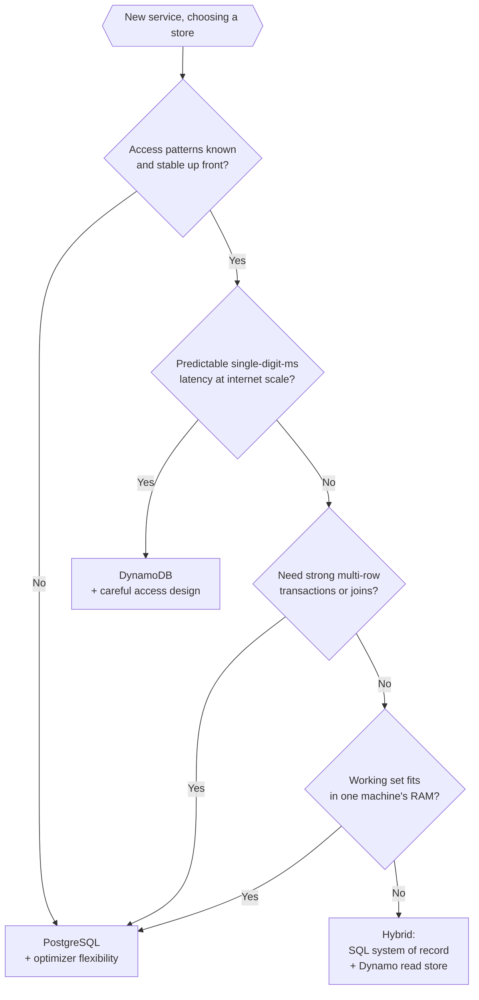

Comparison at a glance:

| Dimension | PostgreSQL | DynamoDB |
|---|---|---|
| Data model | Relational (rows, joins) | Wide-column / key-value (items, item collections) |
| Query flexibility | Declarative SQL, ad-hoc | Pre-designed access patterns only |
| Transactions | Multi-row, multi-table, long-running | Up to 100 items per request |
| Consistency default | Strong on primary | Eventual (strong on demand) |
| Scaling axis | Vertical first, sharding hard | Horizontal automatic via partition key |
| Schema | Explicit, enforced | Implicit, per-item |
| Operational floor | Tuning, vacuum, failover | Mostly managed |
| Failure when wrong | Slow queries, lock contention | Hot partitions, throttling |
| Cost driver | Instance size, IOPS | RCU/WCU, GSIs, storage |

## System Map

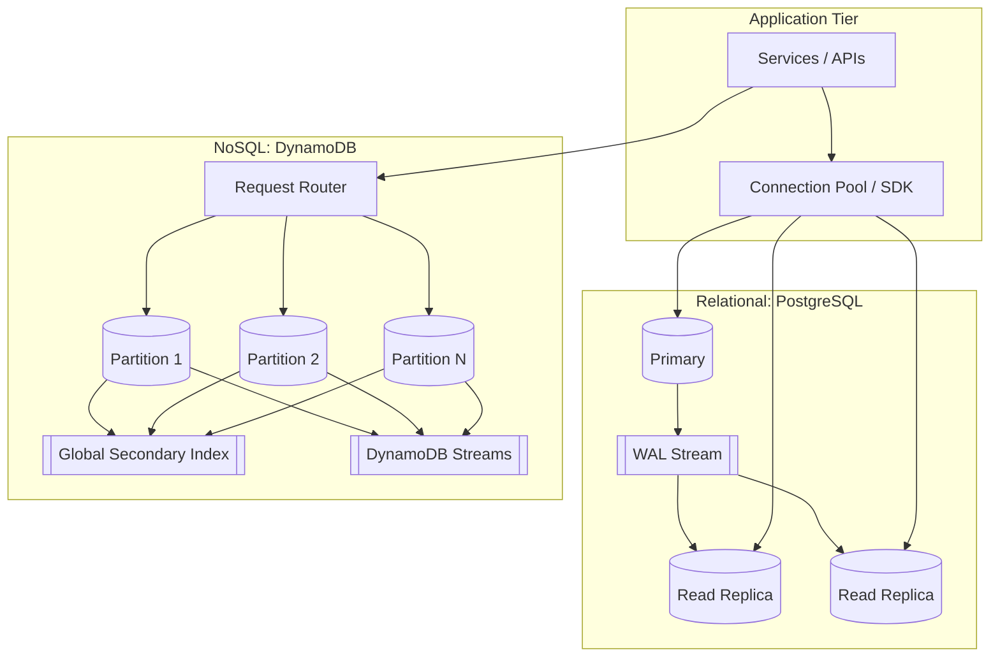

The two systems look superficially similar at the network edge but behave very differently below. Postgres concentrates state in a primary and streams a log to followers; DynamoDB spreads state across many partitions from the start and uses replication within each partition for durability.

## 1. Foundational Concepts

### 1.1 Data Models

- **Relational**: data in tables of rows and typed columns; relationships expressed by foreign keys; queries expressed in SQL, a declarative language compiled by a query planner.
- **Key-value**: data accessed by a primary key, value is opaque to the engine. Fastest to scale, hardest to query.
- **Document**: value is structured (usually JSON) and the engine can index inside it. MongoDB, Couchbase, DynamoDB (when items are nested maps).
- **Wide-column**: rows have a partition key plus a sort/clustering key; columns within a row are sparse and can vary. Cassandra, Bigtable, DynamoDB. The model is closer to "ordered map of ordered maps" than to a relational table.
- **Graph**: nodes and edges as first-class entities; queries traverse relationships. Neo4j, Neptune.
- **Search**: inverted indexes optimized for full-text and ranked retrieval. Elasticsearch, OpenSearch.
- **Time-series and columnar**: optimized for append-heavy, time-keyed data and aggregate scans. InfluxDB, TimescaleDB, ClickHouse.

Senior-level point: the model is not just about "what JSON shapes can I store". It dictates which access patterns are cheap and which are catastrophic. A wide-column store can serve millions of "give me the last 100 events for user X" requests per second with constant cost; the same store will collapse if you ask "give me all users who had more than 5 events last week" without precomputing it.

### 1.2 ACID, BASE, and the CAP/PACELC Tradeoff

- **ACID** (Atomicity, Consistency, Isolation, Durability) is the contract a transactional system gives the application. The hardest one in practice is Isolation; the most expensive is Durability.
- **BASE** (Basically Available, Soft state, Eventual consistency) is a description, not a goal. Many "BASE" systems can offer strong consistency on request at higher cost.
- **CAP**: during a network partition, a distributed system must choose between consistency and availability. CP systems refuse writes when they cannot guarantee linearizability; AP systems accept writes and reconcile later.
- **PACELC** refines CAP: even in the absence of a partition, there is a latency vs consistency tradeoff. DynamoDB by default chooses lower latency and eventual consistency on reads.

Staff-level nuance: real systems are not pure CP or AP. Postgres is CP within a primary, but its asynchronous replicas serve potentially stale data. DynamoDB is AP by default but offers strongly consistent reads on the primary partition and serializable transactions over up to 100 items.

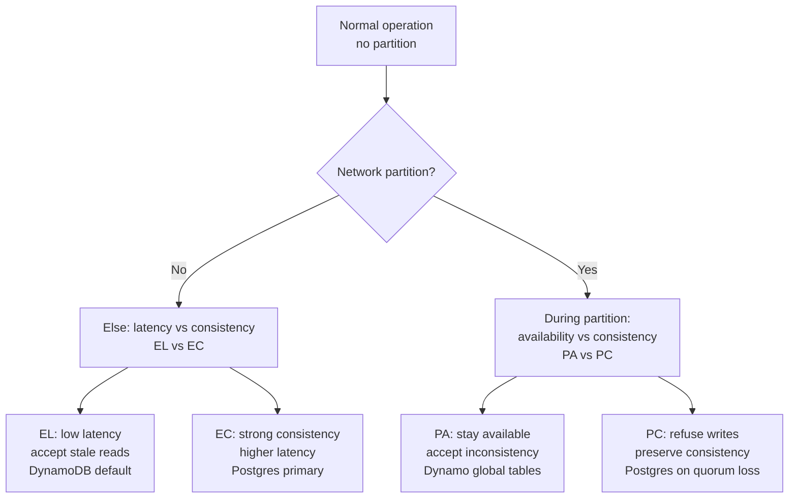

PACELC reads as "if Partition then choose A or C, Else choose L or C". Both axes are design choices, not laws of nature; the same system can sit in different corners at different layers (e.g., a strongly consistent leader plus eventually consistent followers).

### 1.3 Isolation Levels

Standard SQL isolation levels in increasing strictness:

- **Read uncommitted**: dirty reads allowed. Rare in modern systems.
- **Read committed**: each statement sees only committed data; non-repeatable reads possible. Postgres default.
- **Repeatable read**: a transaction sees a stable snapshot; phantom reads possible in standard SQL but Postgres prevents them via snapshot isolation.
- **Serializable**: equivalent to some serial order. Postgres implements SSI (Serializable Snapshot Isolation) with predicate locking and can abort transactions with `40001` (serialization failure).

Anomalies allowed at each level (✓ allowed, ✗ prevented):

| Level | Dirty read | Non-repeatable read | Phantom read | Write skew |
|---|---|---|---|---|
| Read uncommitted | ✓ | ✓ | ✓ | ✓ |
| Read committed | ✗ | ✓ | ✓ | ✓ |
| Repeatable read (ANSI) | ✗ | ✗ | ✓ | ✓ |
| Snapshot (Postgres RR) | ✗ | ✗ | ✗ | ✓ |
| Serializable (SSI) | ✗ | ✗ | ✗ | ✗ |

Write skew is the canonical example that snapshot isolation alone does not prevent: two transactions read the same set, each makes a local decision based on it, and both commit, violating an invariant that depended on the combined view. SSI catches it; snapshot isolation does not.

Note that "serializable" in different engines does not mean the same thing. MySQL InnoDB serializable uses gap locks and blocking; Postgres SSI is optimistic and produces retryable errors. Code that retries `40001` on Postgres may block forever on InnoDB.

DynamoDB transactions are serializable across up to 100 items in a single request, but there is no concept of long-running multi-statement transactions. The unit of atomicity is the transactional request.

### 1.4 Consistency Models for Distributed Reads

- **Linearizable / strong**: a read sees the latest acknowledged write.
- **Sequential**: all clients see operations in the same order, not necessarily real-time.
- **Causal**: reads respect happens-before order.
- **Eventual**: replicas converge if writes stop.
- **Read-your-writes**: a client sees its own writes.
- **Monotonic reads**: a client never sees time go backwards.

DynamoDB defaults to eventual consistency on standard reads, and offers strongly consistent reads at twice the read cost, only on the leader partition. Global tables across regions are eventually consistent by design; do not assume read-your-writes across regions.

Postgres primary is linearizable for a single transaction. Replicas are eventually consistent and can be configured for synchronous commit (`synchronous_commit = remote_apply`) at a latency cost.

## 2. PostgreSQL Deep Dive

### 2.1 Process Architecture

Postgres uses a process-per-connection model. The postmaster forks a backend per client connection. Each backend has its own memory and file descriptors. Background processes handle autovacuum, WAL writing, checkpointing, replication, and statistics.

Operational consequences:

- Each connection costs memory (a few MB to tens of MB depending on `work_mem`). Thousands of idle connections are expensive.
- Connection pooling (PgBouncer, Pgpool, application-level pools) is not optional at scale. Transaction-mode pooling is the most common and lets you multiplex many clients onto few backends, but it breaks features that rely on session state (prepared statements, `SET LOCAL`, advisory locks).
- Long-running queries pin a backend and block resources; cancel them aggressively in tooling.

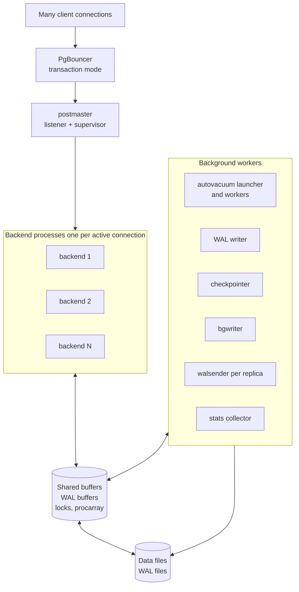

### 2.2 MVCC and Vacuum

Postgres implements MVCC by writing a new row version on every update and marking the old version as expired with the transaction ID. Readers see a snapshot consistent with their transaction start; they never block writers and vice versa.

Consequences:

- Updates are physically inserts plus a logical "kill" of the old row. Heavily updated tables bloat.
- Dead row versions are reclaimed by `VACUUM`. Autovacuum runs in the background based on table activity. If autovacuum cannot keep up, tables and indexes grow, hot pages stay cold, and query plans degrade.
- Transaction ID wraparound is a real, catastrophic failure mode. Postgres uses 32-bit transaction IDs and freezes old rows to prevent wraparound. Disabling autovacuum or letting it fall behind on a write-heavy database can lead to the database forcing single-user mode to avoid corruption.
- `VACUUM FULL` rewrites the table and is blocking; use `pg_repack` or partitioning rotation instead in production.

Staff-level point: the number one cause of "Postgres got slow overnight" is autovacuum tuning. Defaults are conservative; high-write tables need per-table `autovacuum_vacuum_scale_factor` and `autovacuum_analyze_scale_factor` overrides.

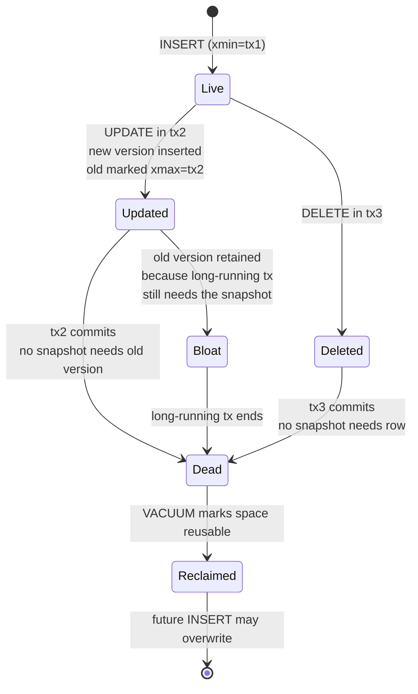

A long-running transaction anywhere in the cluster pins old row versions everywhere, because vacuum cannot reclaim a version that any open snapshot might still need. This is why `idle_in_transaction_session_timeout` exists.

### 2.3 WAL, Checkpoints, and Durability

Every change is first written to the Write-Ahead Log (WAL) before the data files are updated. Crash recovery replays the WAL from the last checkpoint.

- `fsync = on` and `synchronous_commit = on` together give you ACID durability for a single node.
- `synchronous_commit = off` makes commits return before the WAL is fsynced; you can lose the last few hundred milliseconds of committed transactions on a crash. Useful for non-critical workloads.
- Checkpoints flush dirty buffers to disk and advance the recovery start point. Aggressive checkpointing (`checkpoint_timeout` low, `max_wal_size` low) smooths I/O but can cause more total writes. Lazy checkpointing concentrates I/O bursts.
- Streaming replication ships WAL records to replicas. Logical replication decodes WAL into row-level changes for selective replication and cross-version upgrades.

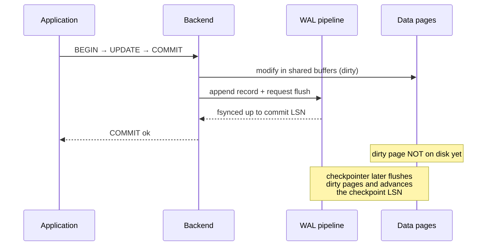

The commit returns as soon as WAL is fsynced. Data file flushes happen lazily at checkpoint time, which is why recovery replays WAL from the last checkpoint forward.

Failure mode: a full WAL volume crashes the primary. Always monitor WAL disk separately from data disk, and never put WAL archive failures on the critical path without an alert.

### 2.4 Query Planner and Statistics

The planner is cost-based. It uses statistics gathered by `ANALYZE` (selectivity, most common values, histograms) to estimate row counts at each step, then picks a plan with the lowest estimated cost.

Common pitfalls:

- Stale statistics after a bulk load lead to bad plans. Run `ANALYZE` after large data movements.
- Correlated columns can fool the planner; extended statistics (`CREATE STATISTICS`) help.
- `LIMIT` combined with sort can flip the plan toward an index that turns out to be terrible if the predicate is highly selective and the sort key is not.
- Parameter sniffing is not a thing in Postgres in the SQL Server sense, but generic vs custom plans for prepared statements can surprise you. After the sixth execution, Postgres may switch to a generic plan that ignores parameters.

`EXPLAIN (ANALYZE, BUFFERS, VERBOSE)` is the primary tool. Read it bottom-up. Pay attention to:

- Estimated vs actual rows. Order-of-magnitude differences mean the planner is flying blind.
- `Buffers: shared hit` vs `read`. Reads from disk are 100x to 10000x slower.
- `Rows Removed by Filter`. A large number means the index is not selective enough.

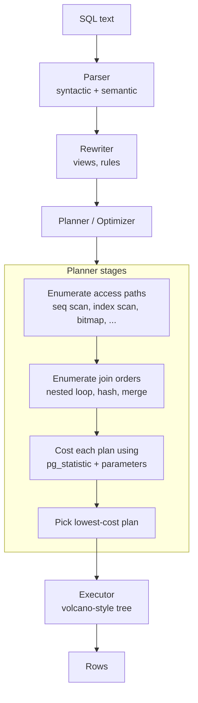

EXPLAIN shows the tree the executor will walk. Each node has an estimated row count from the planner and, with `ANALYZE`, an actual row count from the execution. Large estimate/actual mismatches are the planner's way of telling you its statistics no longer match reality.

### 2.5 Indexing in PostgreSQL

Postgres supports several index types. Choosing the right one is a real engineering decision.

| Type | Best for | Operators | Cost profile | Notes |
|---|---|---|---|---|
| B-tree | Equality, range, sort | `=`, `<`, `<=`, `>`, `>=`, `BETWEEN`, `ORDER BY` | Balanced reads and writes | Default; supports unique, multi-column, `INCLUDE` |
| Hash | Equality only | `=` | Slightly smaller than B-tree | Rarely chosen; crash-safe since 10 |
| GIN | Multi-value columns | `@>`, `?`, full-text `@@`, array overlap | Fast reads, slow writes | `tsvector`, `jsonb`, arrays; tune `fastupdate` |
| GiST | Geometric, ranges, similarity | `&&`, `<->`, `~=` | Balanced | PostGIS, `pg_trgm`, range types, KNN search |
| SP-GiST | Non-balanced trees | Same family as GiST | Cheap inserts | Quad-trees, IP prefixes, suffix trees |
| BRIN | Huge tables, physical order | Range scans on correlated columns | Tiny; cheap updates | Time-series logs; useless without correlation |
| Bloom | Many low-selectivity columns | Combined equality across columns | Probabilistic; rechecks heap | Niche; rarely a first choice |

Multi-column B-tree indexes: order matters. An index on `(a, b, c)` supports queries on `a`, `(a, b)`, `(a, b, c)`, and `a` with `b` and `c` as inequalities, but not on `b` alone. Place equality predicates first, range predicates last.

Other techniques:

- **Partial indexes**: `CREATE INDEX ... WHERE status = 'pending'`. Smaller, faster, only covers a subset. Excellent for queues, soft-deleted records, hot subsets.
- **Expression indexes**: `CREATE INDEX ON users (lower(email))`. Required when queries apply a function; otherwise the planner ignores the regular index.
- **Covering indexes** with `INCLUDE`: keep extra columns in the leaf pages to enable index-only scans without affecting the key.
- **Concurrent index creation**: `CREATE INDEX CONCURRENTLY` does not block writes but takes longer and can fail; you must clean up invalid indexes.

Failure modes:

- Indexes on heavily updated columns cause write amplification. Every update touches every index on the table.
- Unused indexes waste memory and slow writes. Check `pg_stat_user_indexes` regularly.
- Bloated indexes hurt performance silently. Use `pgstattuple` or `pg_repack` to rebuild.

### 2.6 Joins, CTEs, and Subqueries

- The planner picks between **nested loop**, **hash join**, and **merge join** based on row counts and available indexes. Nested loops with an indexed inner side are excellent for small outer relations; hash joins win for large balanced sets.
- Since Postgres 12, CTEs are not always optimization fences. `WITH ... AS (NOT MATERIALIZED)` is the default for non-recursive CTEs without side effects. Older code relying on CTEs as optimization barriers may behave differently after an upgrade.
- Lateral joins (`JOIN LATERAL`) are powerful for per-row subqueries (top-N per group) and replace many correlated subqueries cleanly.

### 2.7 Partitioning

Declarative partitioning (range, list, hash) since Postgres 10 is mature in recent versions. Use cases:

- Time-series: range partition by month or day. Drop old partitions instantly instead of `DELETE` (which is slow and creates bloat).
- Multi-tenant: list or hash partition by tenant_id when one tenant dominates volume.
- Very large tables (hundreds of GB to TB) where index size and vacuum cost are problematic.

Tradeoffs:

- Partition pruning at plan time and run time helps when the partition key is in the query. Without it, every partition is scanned.
- Unique constraints across partitions require the partition key as part of the key.
- Foreign keys to partitioned tables and from partitioned tables have evolved but still have edge cases; check the version.
- Too many partitions (thousands) hurt planner performance and connection memory.

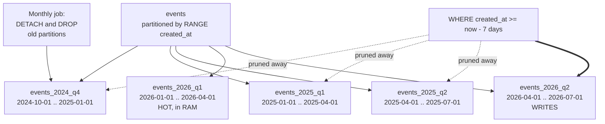

Dropping a partition is O(1) and atomic; deleting equivalent rows from a single table is expensive and creates bloat. This is the operational win that justifies the planning overhead.

### 2.8 Replication and High Availability

- **Streaming replication**: WAL-based, byte-for-byte, same version. Replicas can serve read-only queries. Failover requires a tool (Patroni, repmgr, RDS multi-AZ).
- **Logical replication**: row-level, decoded from WAL. Can replicate a subset of tables to a different version or different schema. Useful for blue/green upgrades and cross-region change capture.
- **Synchronous replication**: commits wait for at least one replica. Reduces data loss risk on failover at the cost of write latency.
- **Quorum commit**: `synchronous_standby_names = 'ANY 2 (r1, r2, r3)'` waits for any two replicas.

Failover concerns:

- Split-brain: two primaries accepting writes. STONITH (fence the old primary) is mandatory.
- Replica lag: monitor `pg_stat_replication.replay_lag`. Reads from lagged replicas violate user expectations even if technically consistent.
- Switchover vs failover: planned switchover should be lossless; failover under crash conditions can lose the in-flight transactions not yet replicated.

<!-- scale:75% -->
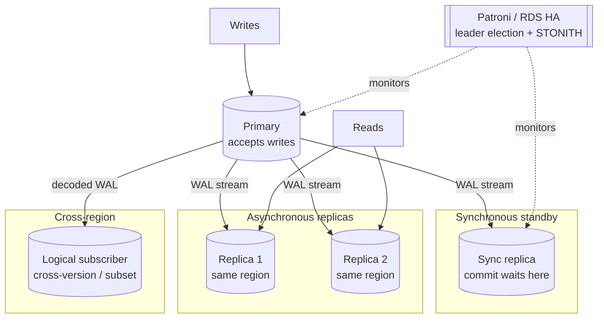

Synchronous commit waits for at least one standby to fsync the WAL before acknowledging the client; that standby is the safe failover target. Async replicas trade RPO for latency. Logical subscribers are useful for upgrades and integration but are not first-class HA targets.

### 2.9 Scaling PostgreSQL

In rough order of impact and complexity:

1. **Vertical scale**: more CPU, more RAM, faster NVMe. Postgres scales well to large machines; do not underestimate this option.
2. **Tune for working set in memory**: `shared_buffers` (around 25 percent of RAM), `effective_cache_size` (around 75 percent), enough `work_mem` to avoid disk sorts.
3. **Connection pooling**: PgBouncer in transaction mode. Cap backends at a number the CPU can actually serve concurrently (a few times the core count).
4. **Read replicas**: offload reporting and idempotent read traffic. Beware replication lag on read-your-writes paths; route those to the primary.
5. **Partitioning**: reduce per-query work and isolate hot data.
6. **Sharding**: split by tenant or hash key across independent clusters. Citus is the most common managed option; otherwise application-level sharding. Cross-shard transactions are hard; cross-shard joins are expensive.
7. **Offload analytics**: replicate to a columnar warehouse for analytical queries. Do not run multi-hour aggregates on the OLTP primary.

## 3. DynamoDB Deep Dive

### 3.1 Data Model

A DynamoDB table is a collection of items. Each item has:

- A required **partition key** (PK), also called the hash key. Determines physical placement.
- An optional **sort key** (SK), also called the range key. Items with the same PK form an item collection, ordered by SK.
- Arbitrary other attributes. The schema is per-item; only PK and SK are mandatory and typed at table creation.

Item size limit: 400 KB including attribute names. Attribute names count toward billing and size; prefer short names in hot paths (`p` instead of `productName`).

The "wide-column" framing matters: an item collection (same PK, varying SK) is the unit of locality. Range queries within a collection are cheap. Queries across collections require a Scan or a Global Secondary Index.

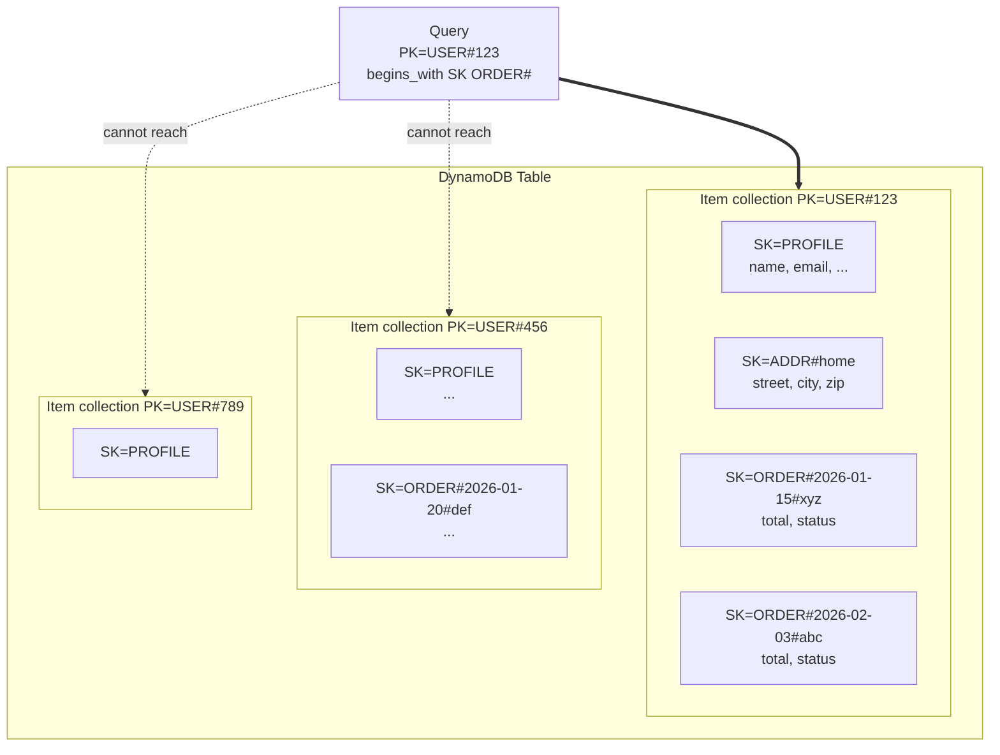

A Query is bounded by the partition key; you cannot ask "give me all orders" without a different index or a Scan. Design implication: every entity needs at least one access path whose PK matches a real query.

### 3.2 Partitioning and Physical Storage

DynamoDB hashes the PK to assign each item to a physical partition (currently up to 10 GB and 3000 RCU + 1000 WCU per partition, with adaptive capacity smoothing skew). Each partition is replicated across three Availability Zones.

Consequences:

- Throughput scales linearly with the number of distinct partition keys, as long as access is balanced.
- A "hot partition" (one PK getting disproportionate traffic) throttles, even if the table has spare capacity. Adaptive capacity helps but does not eliminate the problem; design the PK for spread.
- Item collections (same PK) are limited to 10 GB total when a Local Secondary Index exists; without LSIs, there is no hard limit but you still want to keep them bounded.

Common anti-patterns:

- Using a low-cardinality key (e.g., `status = 'active'`) as PK. All "active" items pile onto one partition.
- Using a monotonically increasing key (e.g., timestamp, sequential ID) as PK without sharding. Most writes hit the most recent partition.
- Using a single tenant as PK for a large multi-tenant table. The biggest tenant becomes the hot partition.

Mitigations:

- Write sharding: prefix the PK with a random suffix bucket (`user#42#shard3`) and scatter reads across shards.
- Compound keys: combine multiple attributes to spread load (`tenant#user`).
- Time-based PK with date precision matched to access patterns.

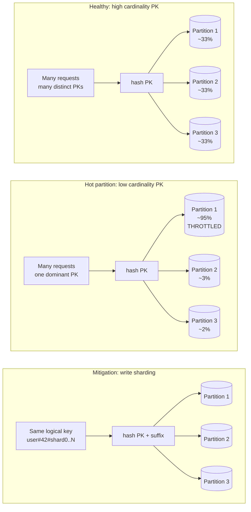

The cost of write sharding is that reads must fan out across all shards and merge results. Pick the shard count to balance write spread against read fan-out.

### 3.3 Capacity Modes

- **Provisioned**: you set RCU (Read Capacity Units) and WCU (Write Capacity Units). Cheaper for predictable steady load. Can be combined with auto-scaling, but auto-scaling reacts slowly (minutes) and is not appropriate for sharp spikes.
- **On-demand**: pay per request, no capacity planning. Higher per-request cost. Best for unknown or spiky workloads, dev environments, and anything where over-provisioning would dominate cost.

A read consumes 1 RCU for a strongly consistent read of up to 4 KB, 0.5 RCU for an eventually consistent read of up to 4 KB, and 2 RCU per item in a transactional read. A write consumes 1 WCU per 1 KB, 2 WCU for transactional writes. Index updates consume capacity on the index, not just the base table.

Capacity cost cheat sheet (per item, base table; multiply by item size in 4 KB / 1 KB units):

| Operation | Capacity cost | Notes |
|---|---|---|
| GetItem, eventually consistent | 0.5 RCU per 4 KB | Default; halves cost vs strong |
| GetItem, strongly consistent | 1 RCU per 4 KB | Base table only, not GSIs |
| TransactGetItems | 2 RCU per 4 KB | Serializable read |
| PutItem / UpdateItem / DeleteItem | 1 WCU per 1 KB | Plus 1 WCU per 1 KB per GSI projected |
| TransactWriteItems | 2 WCU per 1 KB | Across up to 100 items |
| Query (returning N items) | Sum of item sizes | Cheaper than N GetItems |

Staff-level point: capacity math at design time matters. A "small" 10x write amplification (5 GSIs replicating a write, plus a TTL-driven Streams record) can multiply costs invisibly.

### 3.4 Secondary Indexes

- **Local Secondary Index (LSI)**: same PK as the base table, different SK. Must be defined at table creation. Strongly consistent reads possible. Shares the 10 GB item-collection limit. Rarely used in new designs.
- **Global Secondary Index (GSI)**: different PK (and optionally different SK). Can be added at any time. Eventually consistent only. Has its own provisioned capacity (in provisioned mode).

| Property | LSI | GSI |
|---|---|---|
| Partition key | Same as base table | Any attribute |
| Sort key | Different from base | Any attribute (optional) |
| Defined at | Table creation only | Any time |
| Consistency | Eventual or strong | Eventual only |
| Capacity | Shares base table | Independent |
| Storage | Same item collection | Separate, asynchronous |
| Collection size limit | 10 GB per PK across base + LSIs | None (own physical storage) |
| Typical use | "Same parent, alternate order" | "Different access pattern, different key" |

GSI rules to internalize:

- A GSI is a separate, asynchronously updated copy of selected attributes. Writes to the base table cause writes to every GSI. If GSI capacity is insufficient, base writes succeed but the GSI falls behind.
- Sparse indexes are a powerful pattern: only items that have the GSI's PK attribute are projected. Use for "find items in state X" queries by only setting the attribute when the item is in that state.
- Attribute projection (`KEYS_ONLY`, `INCLUDE`, `ALL`) controls cost. `ALL` is convenient but doubles storage and write cost.
- Overloading a GSI: store multiple entity types in one GSI by using a generic attribute name as the GSI PK. Central to single-table design.

### 3.5 Single-Table Design

DynamoDB designs typically use one table per service (or per bounded context), with multiple entity types co-located by carefully chosen PK and SK formats. Example:

- `PK = "USER#123"`, `SK = "PROFILE"` for a user profile.
- `PK = "USER#123"`, `SK = "ORDER#2026-01-15#xyz"` for that user's orders.
- A query on `PK = "USER#123"` and `begins_with(SK, "ORDER#")` returns the user's orders in order.

A small slice of such a table:

| PK | SK | type | attrs | GSI1PK | GSI1SK |
|---|---|---|---|---|---|
| USER#123 | PROFILE | user | name, email | EMAIL#a@x.com | USER#123 |
| USER#123 | ADDR#home | address | street, city | — | — |
| USER#123 | ORDER#2026-01-15#xyz | order | total=80 EUR, status=paid | STATUS#paid | 2026-01-15#xyz |
| USER#123 | ORDER#2026-02-03#abc | order | total=20 EUR, status=pending | STATUS#pending | 2026-02-03#abc |
| USER#456 | PROFILE | user | name, email | EMAIL#b@y.com | USER#456 |
| USER#456 | ORDER#2026-01-20#def | order | total=50 EUR, status=paid | STATUS#paid | 2026-01-20#def |

Access patterns served from this layout:

- "Get user 123 with all their orders": `Query PK=USER#123`.
- "Get user 123's orders only": `Query PK=USER#123 AND begins_with(SK, "ORDER#")`.
- "Find a user by email": `Query GSI1 with GSI1PK=EMAIL#a@x.com`.
- "List pending orders globally": `Query GSI1 with GSI1PK=STATUS#pending` (a sparse GSI if the attribute is only set while pending).

Tradeoffs:

- Pros: minimum number of requests per access pattern, naturally bounded item collections, ability to fetch parent and children in one query.
- Cons: schema is implicit and hard to enforce; every new access pattern may require a new GSI or a redesign; data exports are awkward.

The discipline required is real: you cannot evolve a single-table design without re-reading the design doc. Treat the access pattern catalog as a first-class artifact, kept under version control alongside the schema.

### 3.6 Transactions and Consistency

DynamoDB offers:

- Single-item conditional writes (`ConditionExpression`). Atomic and durable. Use for optimistic concurrency control (`#version = :expected_version`).
- `TransactWriteItems` / `TransactGetItems`: up to 100 items, serializable, all-or-nothing. Cost twice the WCU/RCU of a normal operation.
- Eventually consistent reads by default; strongly consistent reads on demand on the base table only.

Important: there is no equivalent of long-running multi-statement transactions. If you need read-modify-write across many items, you must either use transactions (size-limited) or implement compensation with idempotent operations.

### 3.7 Streams, TTL, and Change Capture

- **DynamoDB Streams**: ordered per partition, time-bounded (24 hours). Each item modification produces a record with old and new images (configurable). Consumed by Lambda, Kinesis Adapter, or directly.
- **TTL**: a special timestamp attribute; items are deleted asynchronously (within ~48 hours) once expired. Deletions appear in Streams as `userIdentity.principalId = "dynamodb.amazonaws.com"`. Important: TTL is best-effort, not real-time; do not use it for security-sensitive expirations.
- **Kinesis Data Streams for DynamoDB**: longer retention and more flexible consumers than native Streams.

Streams are the foundation for outbox patterns, search-engine projection, and cross-region replication via global tables.

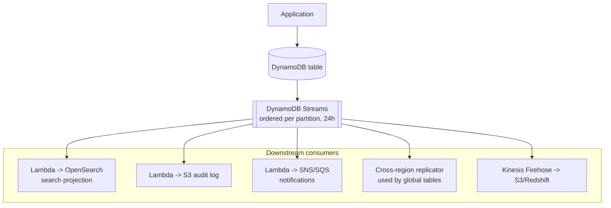

Streams replace dual-writes from the application: instead of "write to DB then write to search index" (with all its failure modes), the database is the single source of truth and projections are derived asynchronously and idempotently.

### 3.8 Global Tables and Multi-Region

Global tables replicate writes across regions, with last-writer-wins conflict resolution based on the timestamp of the write. This means:

- Concurrent updates to the same item in different regions can silently overwrite each other.
- The application must tolerate eventual consistency across regions; do not assume read-your-writes if the user can be routed to a different region.
- Conflict-prone data (counters, sets) needs CRDT-like patterns or region affinity.

<!-- scale:60% -->
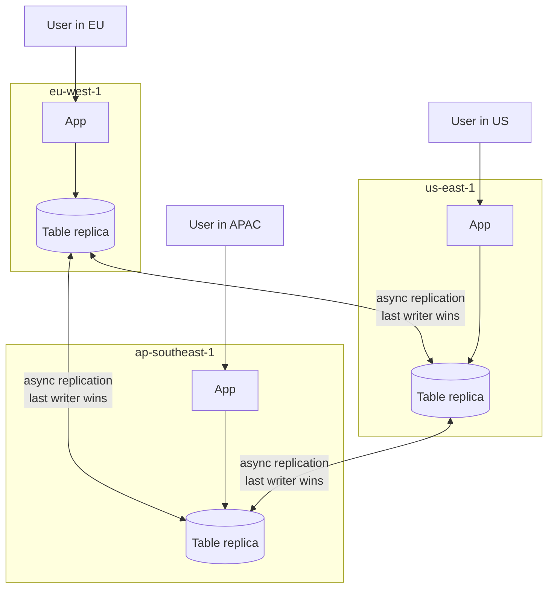

Last-writer-wins is decided by wall-clock timestamp on the originating region. Clock skew between regions, even if small, can determine which of two concurrent updates survives. Design conflict-prone operations (counters, balances, set membership) to be region-affine or to use idempotent merge logic.

### 3.9 Scaling DynamoDB

Scaling DynamoDB is largely about access pattern design, because the engine handles the rest:

1. **Distribute keys**: ensure high cardinality and even access. Audit production for hot keys.
2. **Right-size capacity**: provisioned with auto-scaling for steady load, on-demand for spiky.
3. **Cache hot reads**: DAX (DynamoDB Accelerator) for microsecond reads when the working set is small. External caches (Redis) for cross-table caching.
4. **Compress and pack**: avoid 400 KB item bloat; consider storing large blobs in S3 with a pointer.
5. **Use BatchGet / BatchWrite**: amortize round trips; mind that batches can have partial failures.
6. **GSI sharding**: same logic as base table; do not create low-cardinality GSI PKs.
7. **Global tables**: scale reads geographically; understand the conflict model first.

What you cannot do: write a complex ad-hoc query and hope the engine figures it out. There is no planner; if no index supports the query, you Scan, and Scans on production-sized tables are operationally unacceptable.

## 4. Indexing Strategies, Side by Side

Both engines reward up-front thought, but the consequences of getting it wrong differ.

### 4.1 Postgres Indexing Patterns

- **Cover the predicate, not the column list**: an index that matches `WHERE status = 'pending' AND created_at < now() - interval '1 hour'` is worth more than five general-purpose indexes.
- **Partial indexes for hot subsets**: queue tables benefit massively from `WHERE state = 'queued'` partial indexes.
- **Index-only scans**: with `INCLUDE` columns and an up-to-date visibility map, Postgres can serve queries without touching the heap. Vacuum keeps the visibility map fresh; under-vacuumed tables lose this benefit silently.
- **Multi-column ordering**: lead with high-selectivity equality columns, follow with range and sort columns. Match the index order to the most expensive query.
- **JSONB indexing**: `GIN (jsonb_column jsonb_path_ops)` for containment; expression indexes on specific paths for equality.
- **Watch index bloat**: rebuild with `REINDEX CONCURRENTLY` periodically on heavily updated tables.

### 4.2 DynamoDB Indexing Patterns

- **Design the PK first**: the PK is the only thing that controls partitioning. Everything else is secondary.
- **SK as a query language**: `begins_with`, `between`, range scans on SK are the only "joins" you have. Choose SK formats that encode hierarchy (`COUNTRY#ES#CITY#MADRID#VENUE#42`).
- **GSIs as alternate views**: think of a GSI as a denormalized projection, not as a "secondary index" in the SQL sense. Each one costs capacity and storage.
- **Sparse GSIs**: write the GSI PK attribute only when the item should be visible. Excellent for "find unverified accounts" queries.
- **GSI overloading**: store multiple entity types in one GSI by reusing the same attribute names with different value formats. Central to keeping GSI count low.
- **No `OR`, no joins, no aggregates**: every access pattern needs an index or a redesign. Inventory the access patterns before the schema.

### 4.3 Decision Heuristics

- If the access patterns are stable and well understood: DynamoDB-style careful design pays off and the operational profile is excellent.
- If the access patterns will evolve and ad-hoc queries are valuable: Postgres-style indexing pays off and the optimizer earns its keep.
- If you need both transactional consistency across many rows and predictable single-key latency at internet scale: you probably need two systems, with a clearly defined source of truth and a projection pipeline between them.

## 5. Optimization Techniques

### 5.1 Generic Optimizations

- **Measure first**: never optimize without a profile. `EXPLAIN ANALYZE` for Postgres, CloudWatch metrics and the Contributor Insights for DynamoDB.
- **Reduce round trips**: batch reads and writes when you can; pipeline operations; prefer one query that returns the working set over N small queries.
- **Cache deliberately**: cache invalidation is a separate, expensive design problem; do not introduce a cache layer without a clear ownership and freshness model. Read-through, write-through, write-behind, and TTL-only caches all have different correctness and performance profiles.
- **Push computation to the database when it has the indexes**: aggregations and filters in SQL are usually faster than in application code over a fetched dataset. Push computation to the application when the database lacks the indexes or when the work is CPU-bound on a shared resource.
- **Move work out of the request path**: precompute counters, denormalize hot reads, project into search engines for ad-hoc text queries, build read models in event-sourced systems.

### 5.2 Postgres-Specific Optimizations

- **Plan stability**: keep statistics current with autovacuum analyze. For unstable plans, use `pg_hint_plan` only as a last resort; fix the underlying cardinality or index instead.
- **`work_mem` tuning**: too low means disk sorts and hash spills; too high means OOM under concurrency. Set per-query for heavy reporting, not globally.
- **Connection pooling and prepared statements**: prepared statements amortize parsing and planning, but in transaction-pool mode they cache per-backend, which complicates the savings. Measure.
- **Bulk loads**: use `COPY`, drop indexes before, recreate after; or use `UNLOGGED` tables for transient staging and convert.
- **Vacuum and autovacuum tuning**: per-table thresholds on busy tables (`SET (autovacuum_vacuum_scale_factor = 0.05)`) reduce bloat dramatically.
- **HOT updates**: if an update does not touch any indexed column and the page has room, Postgres can do a Heap-Only Tuple update that avoids touching indexes. Lower `fillfactor` on hot tables (to ~70-90) to leave room.
- **Avoid `SELECT *`**: forces the planner to fetch the full row from the heap even when an index could serve the query.

### 5.3 DynamoDB-Specific Optimizations

- **Query, do not Scan**: a Scan reads the entire table and is the correct answer only for offline maintenance.
- **Project narrowly**: `ProjectionExpression` reduces both network and capacity cost.
- **Avoid large items in hot paths**: a 380 KB item read costs 95 RCUs strongly consistent; the same logical data split across small items can be cheaper if access is selective.
- **Use Query pagination**: `Limit` plus `LastEvaluatedKey` is the right tool; do not naively scroll all pages in the foreground.
- **TTL for housekeeping**: avoid scheduled cleanup jobs that scan; let TTL do the work.
- **Streams for derived data**: keep search indexes, audit logs, and analytics exports up to date via Streams + Lambda rather than dual-writing in the application.
- **DAX for hot reads**: when the read pattern is heavily skewed and the items are small, DAX collapses latency and capacity cost. Stale reads are possible; do not put DAX in front of strongly consistent paths.

## 6. Scaling Methods

### 6.1 Vertical Scaling

The cheapest engineering option, often unfairly dismissed. Modern hardware (96+ cores, terabytes of RAM, NVMe) handles workloads that ten years ago required a cluster. A single well-tuned Postgres can serve tens of thousands of transactions per second and many TB of data. Use vertical scaling until you exhaust it or until the failure-domain risk becomes unacceptable.

DynamoDB does not expose vertical scaling; it is implicit in how the service is provisioned.

### 6.2 Read Scaling: Replication and Caching

- **Read replicas (Postgres)**: streaming or logical. Cheap to add, useful for reporting and stateless reads. Watch lag; route latency-sensitive reads to the primary.
- **Caching**: Redis, Memcached, in-process LRUs. The hardest part is invalidation. Patterns: read-through, cache-aside, write-through, write-behind. Each has different consistency tradeoffs.
- **DAX (DynamoDB)**: managed in-memory cache for hot reads.
- **CDN-level caching for public read APIs**: pushes the cache to the edge; useful for catalog-style data.

### 6.3 Write Scaling: Partitioning and Sharding

- **Partitioning (Postgres)**: same database, split table. Reduces vacuum and index size, enables partition-wise joins, supports cheap drop-old-partition cleanup. Does not multiply hardware.
- **Sharding (Postgres)**: split across databases. Choose a shard key with high cardinality and stable access. Cross-shard transactions are expensive; cross-shard joins are not free. Options: Citus, application-level routing, foreign data wrappers, vendor solutions (Aurora Limitless).
- **Partitioning (DynamoDB)**: automatic. The engineering work is the PK design.
- **Write batching and queueing**: accept writes into a durable queue (Kafka, SQS) and process at the database's sustainable rate. Trades latency and complexity for throughput stability.

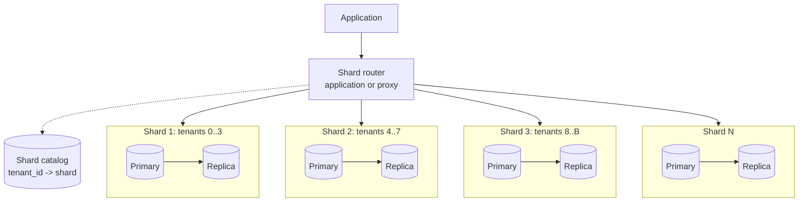

The shard catalog is itself a distributed-systems problem: every router must agree on the mapping. Rebalancing (moving a tenant from shard A to shard B) is the hardest operational task in a sharded system; design it before you need it, not after.

### 6.4 Multi-Region

- **Active-passive (Postgres)**: logical replication or managed services (Aurora Global Database). Failover is operational and rare. Consistency within a region is strong; cross-region reads are stale.
- **Active-active (DynamoDB global tables)**: writes accepted in any region, last-writer-wins. Application must tolerate it.
- **Active-active (Postgres)**: extremely hard. Tools exist (BDR, pgEdge) but the design space is full of correctness traps. Avoid unless the business clearly requires it.

### 6.5 Operational Limits and Failure Domains

A single-instance Postgres is a single failure domain. A managed multi-AZ deployment turns it into a small cluster but still one logical database. A sharded Postgres has many failure domains and many operational surfaces. DynamoDB hides almost all of this, at the cost of model rigidity.

Staff-level decision: how many failure domains do you want to operate, and does the team have the operational maturity for that many? Adding shards before adding observability and runbooks is a common path to outages.

## 7. Operational Concerns

### 7.1 Backup and Restore

- **Postgres**: physical backups (`pg_basebackup`, snapshots) plus WAL archiving give point-in-time recovery. Logical dumps (`pg_dump`) are good for schema portability and small datasets. Always rehearse restore; an untested backup is a hope, not a backup.
- **DynamoDB**: continuous backups with point-in-time recovery (35 days). On-demand backups for longer retention. Restore creates a new table; plan the cutover separately.

### 7.2 Observability

- **Postgres**: `pg_stat_statements`, `pg_stat_activity`, slow query log, autovacuum logs, replication slot lag metrics. Tools: Datadog DBM, pganalyze, RDS Performance Insights, pg_stat_kcache.
- **DynamoDB**: CloudWatch metrics per table and per index (throttling, consumed capacity, latency), Contributor Insights for hot keys, AWS X-Ray for end-to-end traces.
- Both: end-to-end latency SLOs at the application boundary matter more than internal database percentiles. Track them together.

### 7.3 Schema Evolution

- **Postgres**: most DDL is transactional and online (Postgres ≥ 11 for many cases). `ADD COLUMN` with a non-volatile default is instant since Postgres 11. Backfills require batching and care; long-running migrations can block autovacuum.
- **DynamoDB**: schema is implicit. Adding new attributes is free at the table level. Adding new access patterns may require a new GSI (which backfills asynchronously and costs capacity) or a redesign. Renaming attributes requires a migration; plan for dual-write windows.

### 7.4 Security

- **Authentication**: SCRAM-SHA-256 for Postgres; IAM authentication for DynamoDB and for Postgres on managed clouds. Avoid passwords in code; use short-lived credentials.
- **Authorization**: Postgres role and grant system, row-level security (RLS) for multi-tenant isolation. DynamoDB: IAM policies with fine-grained access control down to attributes and items (using `dynamodb:LeadingKeys`).
- **Encryption**: in transit (TLS) and at rest (managed KMS keys). For sensitive fields, application-level encryption before storage.
- **Audit**: `pgaudit` for Postgres; CloudTrail data events for DynamoDB. Logging every read is expensive; scope it to sensitive tables.

### 7.5 Cost Awareness

- **Postgres**: cost is dominated by instance size and storage IOPS; secondary costs are backups and cross-AZ traffic. Storage is cheap relative to compute.
- **DynamoDB**: cost is dominated by RCU/WCU consumption and storage. GSIs multiply cost; large items multiply cost; eventually consistent reads halve cost; on-demand is more expensive per request but eliminates over-provisioning. Streams and global tables add line items.
- In both, the cheapest optimization is often reducing data volume or query frequency, not switching engines.

## Review Checklist

Senior-level questions to ask in a design review.

### For a Postgres design

- What is the expected working set, and will it fit in RAM?
- What are the top five queries by frequency and by latency, and which indexes serve them?
- Are autovacuum settings tuned for the write rate of the busiest tables?
- Is there a connection pooler in front, and is the maximum backend count realistic for the hardware?
- Is replication lag monitored, and where do read-your-writes paths route?
- Is point-in-time recovery configured and tested?
- What is the upgrade plan, and has logical replication been considered for major-version upgrades?
- Are bulk operations and migrations designed to avoid long-held locks?

### For a DynamoDB design

- What are the access patterns, in priority order? Are they documented?
- Does every access pattern have an index that serves it without a Scan?
- What is the partition key, and is its cardinality high enough?
- Are there hot keys today, and what is the plan if a key becomes hot tomorrow?
- How many GSIs are there, and what is the write amplification per change?
- Are item sizes bounded? Are large blobs offloaded to S3?
- Is capacity mode (provisioned vs on-demand) right for the workload curve?
- Are Streams used for derived data, and is consumer backpressure handled?
- For global tables: is the last-writer-wins conflict model acceptable for every entity?

## Common Failure Modes

### PostgreSQL

- **Autovacuum starvation**: bloat grows, plans degrade, eventually wraparound risk. Mitigation: per-table tuning, monitor `n_dead_tup`, alert on age.
- **Connection storm**: thousands of clients connect during an incident; the database stops responding. Mitigation: enforce a pooler, set `max_connections` low enough that the OS can sustain it, use timeouts aggressively.
- **Long-running transaction**: an open transaction prevents vacuum from cleaning up dead rows across the entire cluster. Mitigation: `idle_in_transaction_session_timeout`, alert on long transactions.
- **Bad plan after upgrade or analyze**: query that took 50 ms now takes 50 s. Mitigation: keep extended statistics, monitor plan changes, have a quick rollback or `ALTER TABLE ... SET (autovacuum_analyze_scale_factor = ...)`.
- **Replication slot leak**: a disconnected logical replica leaves a slot, WAL grows indefinitely until disk fills. Mitigation: monitor and alert on slot lag; drop abandoned slots.
- **Failover loses data**: asynchronous replica promoted, in-flight transactions lost. Mitigation: synchronous replication for critical data; document the RPO.

### DynamoDB

- **Hot partition throttling**: one PK monopolizes a partition's capacity. Mitigation: write sharding, redesign PK, on-demand mode as a temporary buffer.
- **Unbounded item collection**: an item collection with an LSI grows past 10 GB; writes fail. Mitigation: bound collections by design, avoid LSI on growable hierarchies.
- **GSI behind base table**: GSI under-provisioned, base writes succeed but GSI is hours behind; reads through GSI return stale data. Mitigation: monitor GSI consumed vs provisioned, prefer on-demand for variable workloads.
- **Surprise cost**: a forgotten Scan or an `ALL` projection GSI multiplies the bill. Mitigation: budget alerts, periodic cost reviews, deny `Scan` via IAM in production where possible.
- **Cross-region conflicts**: global tables silently lose concurrent writes. Mitigation: region-affine writes, idempotency keys, conflict-aware data types.
- **Throttling cascading into outage**: a downstream system retries aggressively on throttling, multiplying load. Mitigation: exponential backoff with jitter, circuit breakers, queue-and-drain patterns.

<!-- page-break -->
## Interview Q&A

Practical questions with concise answers (each under 100 words).

**Q: Why is `SELECT COUNT(*)` slow in Postgres on large tables?**
A: MVCC means the engine cannot trust any single index to know which rows are visible to your transaction; an index scan still has to confirm visibility against the heap. For an exact count it scans the table or, with an index-only scan, the index plus the visibility map (which must be up to date). For approximate counts, read `n_live_tup` from `pg_stat_user_tables` or the planner's row estimate. For accurate counts on large tables, maintain a counter table with triggers or use materialized views.

**Q: When would you choose DynamoDB over Postgres for a new service?**
A: When the access patterns are well known and stable, throughput needs to scale horizontally without operational effort, latency must be predictable in the single-digit milliseconds at any scale, and you do not need ad-hoc analytical queries on the operational store. If you need flexibility to query data in many shapes that you cannot enumerate up front, Postgres is the safer default.

**Q: A Postgres index exists on `(a, b)`. A query filters on `b` only. Why is the index not used?**
A: B-tree indexes can only be used to seek when the leading column has a predicate. Filtering on `b` alone forces a full index scan or a sequential scan, both of which the planner usually rejects in favor of a `Seq Scan`. The fix is an index leading with `b`, or an index on `(b, a)` if both are needed.

**Q: What is a hot partition in DynamoDB and how do you mitigate it?**
A: A hot partition is a physical partition receiving disproportionate traffic because too many requests target one partition key, exceeding the partition's capacity. Mitigations: design the PK for high cardinality and even access, use write sharding (suffix the PK with a random bucket), switch to on-demand to buy time, and inspect Contributor Insights to confirm the offender. Adaptive capacity helps but does not solve the design problem.

**Q: How does Postgres serializable isolation differ from MySQL's?**
A: Postgres uses Serializable Snapshot Isolation (SSI): transactions run on snapshots and the engine detects dangerous read-write dependencies, aborting one transaction with a `40001` error. It is mostly non-blocking and requires the application to retry. MySQL InnoDB serializable uses gap locks and blocking; transactions wait rather than abort. Code that retries on `40001` works on Postgres but can deadlock or block forever on InnoDB.

**Q: What is the practical limit on the number of GSIs per DynamoDB table?**
A: The service limit is 20 GSIs per table. The practical limit is much lower: every GSI multiplies write cost, increases storage, and adds an asynchronous replication path that can lag. Three to five well-designed GSIs cover most single-table designs; if you find yourself wanting more, you usually have an entity model problem or you need a separate read store fed by Streams.

**Q: When should you partition a Postgres table?**
A: When the table is large enough that vacuum, index bloat, or query planning costs become operational problems (typically hundreds of GB to TB), when access patterns target a clear key (time, tenant), and when you can drop or archive old data by dropping a partition. Partitioning a small table is overhead without benefit; partitioning without partition pruning in the workload is the same.

**Q: How do you do an online schema change in Postgres on a hot table?**
A: For additive changes, `ADD COLUMN` with a constant default is instant since Postgres 11. For renames or type changes, use a dual-write strategy: add the new column, backfill in batches with throttling, dual-write from the application, switch reads, drop the old column. For index changes, `CREATE INDEX CONCURRENTLY` and `DROP INDEX CONCURRENTLY`. Avoid `ALTER TABLE` operations that rewrite the table during business hours.

**Q: What is the difference between strongly consistent and eventually consistent reads in DynamoDB, and when does each matter?**
A: Strongly consistent reads return the most recent committed value at the cost of double the RCU and they only work on the base table (not GSIs). Eventually consistent reads may return stale data within a short window (typically sub-second) at half the cost. Use strongly consistent reads for read-your-writes on the same key, optimistic concurrency checks, and anything where stale data leads to incorrect behavior. Default to eventually consistent for read-heavy public APIs.

**Q: Your Postgres query plan changed overnight and performance dropped. What do you check first?**
A: Run `EXPLAIN ANALYZE` and compare estimated vs actual rows; large mismatches mean statistics are stale or correlated, so `ANALYZE` the relevant tables and consider extended statistics. Check whether autovacuum is healthy. Check whether `pg_stat_statements` shows the same query with a different plan (different parameters can pick different plans). Confirm no recent index drops, partition changes, or planner-affecting parameter changes. As a temporary remediation, run `ANALYZE`, force a re-plan, or pin a hint while you fix the root cause.
